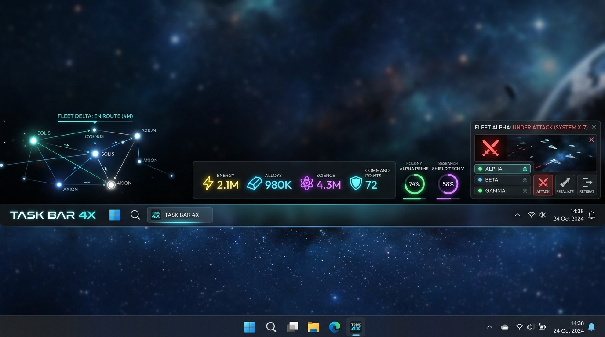

# 🌌 TASK BAR 4X
> **El Imperio de Bolsillo en tu Barra de Tareas.** Un juego de estrategia espacial e histórica 4X (eXplorar, eXpandir, eXplotar, eXterminar) no intrusivo y altamente optimizado en Rust nativo para Microsoft Windows.

---

## 📸 Preview Visual



---

## 🚀 Visión General

**TASK BAR 4X** es un juego incremental de estrategia que coexiste con el flujo de trabajo diario del usuario. Se ejecuta directamente acoplado en la barra de tareas de Windows mediante un **Sistema de Doble Modo**:

1.  **Modo Barra de Tareas (HUD de 48px)**: Un HUD no intrusivo esmerilado (*glassmorphic*) que se integra sobre la barra de herramientas del escritorio. Permite monitorizar la economía de recursos, el progreso de la exploración lineal 1D y el estado militar, permitiendo reaccionar a crisis con clics rápidos sin robar el foco de las aplicaciones de productividad del usuario.
2.  **Modo Pantalla Completa (Vista Táctica)**: Una interfaz inmersiva clásica de gran estrategia (activada con `F11` o doble clic en el Orbe central). Permite la gestión profunda de mapas de campaña 2.5D, diplomacia detallada con facciones controladas por IA, configuración de flotas y reclutamiento, y la visualización de los árboles de tecnología.

---

## ⏳ Progresión por 15 Edades y Decisiones Estratégicas

El juego guía al jugador a través de una progresión de civilización que abarca **15 Edades históricas y futuristas**:

1. **Edad de Piedra** | 2. **Edad del Neolítico** | 3. **Edad del Cobre** | 4. **Edad del Bronce** | 5. **Edad del Hierro** | 6. **Antigüedad Tardía** | 7. **Alta Edad Media** | 8. **Baja Edad Media** | 9. **Renacimiento y Descubrimientos** | 10. **Era de la Ilustración** | 11. **Era Industrial** | 12. **Era Atómica** | 13. **Era de la Expansión Solar** | 14. **Era Interestelar** | 15. **Era de la Singularidad**

### Matriz de Decisiones Binarias (90 Decisiones de Investigación)
En cada Edad se introducen **12 Investigaciones** divididas en **6 Disciplinas**. El jugador debe tomar una decisión binaria y mutuamente excluyente por disciplina, modelando cada partida con ventajas y retos únicos:
*   ⚔️ **Militar**: Fuerza ofensiva móvil vs. Defensas de fortificación.
*   🌾 **Economía**: Producción básica/comida vs. Refinado de metales/carbón.
*   🏛️ **Política**: Estructuras autocráticas centralizadas vs. Consejos democráticos representativos.
*   🎨 **Cultura**: Preservación del conocimiento e influencia vs. Prestigio de construcciones monumentales.
*   ⚛️ **Tecnología**: Avances mecánicos de transporte vs. Cálculos teóricos y micro-circuitos.
*   🕯️ **Religión**: Fervor espiritual y cohesión social vs. Modelos seculares, deístas y transhumanistas.

---

## 🎲 Componente Rogue-like y Bucle de Rejugabilidad

Cada partida de *TASK BAR 4X* es una **Incursión (Run)** con un mapa de caminos estelares y recursos generado de forma procedimental.
*   **Condición de Derrota**: Si tu capital es conquistada o sufre un colapso financiero insostenible, la incursión finaliza en **Lisis del Imperio (Extinción)**.
*   **Polvo de Singularidad**: Divisa de meta-progreso obtenida al finalizar la incursión (proporcional a la edad alcanzada, población y turnos sobrevividos). Se utiliza en la tienda de Legado para comprar mejoras permanentes (como el aumento en la recolección de energía o inmunidad a desastres logísticos).
*   **Reliquias de Era y Artefactos del Vacío**: Modificadores de partida de gran impacto que se descubren investigando anomalías o venciendo en el combate lineal.
*   **Mutadores de Inestabilidad**: Retos de dificultad autoimpuesta al iniciar una era a cambio de multiplicadores de puntuación.

---

## 🛠️ Especificaciones Técnicas y Optimización

Siguiendo principios de rendimiento de bajo nivel para integrarse de forma invisible en el sistema operativo:
*   **Pila Tecnológica**: Desarrollado en **Rust Nativo** con APIs directas de Windows (crates `windows` / `windows-sys`) y renderizado mediante **Direct2D** o **wgpu** de bajo consumo de GPU.
*   **Rendimiento Objetivo**: **RAM < 15MB** en reposo y **CPU ~0.0%** gracias al bucle de mensajes reactivo basado en `WaitMessage()`.
*   **AppBar System (Win32)**: Registro dinámico mediante la API `SHAppBarMessage` para desplazar las ventanas de Windows maximizadas y reservar el espacio físico útil de la barra.
*   **Clics Passthrough**: Alterna el estilo extendido `WS_EX_TRANSPARENT` al pasar el cursor sobre áreas transparentes, permitiendo hacer clics a través de la ventana del juego hacia el escritorio de Windows.
*   **Modo Suspensión Inteligente**: Suspensión automática del renderizado y cálculo físico al detectar aplicaciones 3D en pantalla completa mediante la API `GetForegroundWindow`.
*   **Integración con Steam**: Conectado a la API de Steamworks mediante `steamworks-rs` para logros, Steam Cloud y drops cosméticos comerciables en el *Steam Community Market*.

---

## 📁 Estructura del Repositorio

```
taskbar-4x/
├── docs/                             # Documentación técnica y especificaciones
│   ├── assets/                       # Capturas y recursos visuales (mockups)
│   │   └── taskbar_4x_ui_mockup.jpg  # Boceto visual del HUD en Edad Espacial
│   ├── taskbar_4x_blueprint.md       # Master Blueprint del juego
│   ├── design_ui_ux_spec.md          # Especificaciones de layouts, retículas y popovers
│   ├── design_sprite_assets.md       # Dirección de arte, spritesheets e iconos de las 15 eras
│   ├── design_animations_spec.md     # Fórmulas físicas de pipelines, transiciones y VFX
│   ├── research_sota_mechanics.md    # Análisis del Estado del Arte (SOTA) de juegos idle
│   └── research_indie_dev_process.md # Análisis de ingeniería, Win32 y optimización
└── README.md                         # Este archivo
```

---

## ⚖️ Licencia y Propiedad

**PROPIEDAD PRIVADA COMERCIAL DE BABYLON.IA S.A.S. - TODOS LOS DERECHOS RESERVADOS.**

Este software, código fuente, activos y documentación asociada son propiedad exclusiva y confidencial de **BABYLON.IA S.A.S.** Queda estrictamente prohibida cualquier copia, distribución o uso no autorizado. Consulte el archivo [LICENSE](LICENSE) para más detalles.
