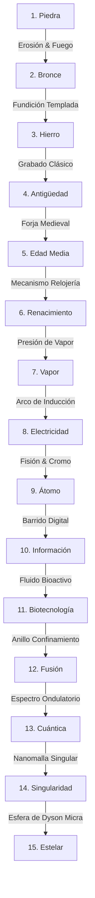

# ESPECIFICACIÓN TÉCNICA DE MICRO-ANIMACIONES, PIPELINES Y EFECTOS VISUALES
## Dirección de Animación y Diseño de Movimiento Principal

Este documento establece las especificaciones físicas, matemáticas y de renderizado para el sistema de micro-animaciones en interfaces compactas, el comportamiento de paquetes en pipelines logísticos, los efectos de combate en el mapa lineal, las alertas de crisis y las transiciones de evolución entre las 15 edades del juego.

---

## 1. TRANSICIONES DE EVOLUCIÓN DE EDAD (15 EDADES)

La barra de tareas y el contenedor de interfaz principal sufren una transformación física y estética al cambiar de Edad. Cada evolución se rige por una curva de aceleración, un conjunto de fotogramas clave y un efecto de renderizado nativo (Direct2D) o Web (Canvas).

### Especificaciones Generales de la Transición
* **Duración total:** 1200 ms (72 fotogramas a 60 FPS).
* **Fórmula de Aceleración:** Curva Bézier Cúbica personalizada para la deformación y la escala física de la barra.
  $$\text{Easing: } \text{Cubic-Bezier}(0.25, 1.5, 0.3, 1.0) \quad \text{(Efecto rebote/anticipación)}$$
* **Efecto de Deformación (Squash & Stretch):**
  * Eje X (Ancho): $S_x(t) = 1.0 + 0.15 \cdot e^{-5t} \cdot \sin(15t)$
  * Eje Y (Alto): $S_y(t) = 1.0 - 0.15 \cdot e^{-5t} \cdot \sin(15t)$

---

### Catálogo de Edades y Efectos Específicos



#### 1. Edad de Piedra (Paleolítico/Neolítico)
* **Estética:** Texturas rugosas de piedra caliza, madera astillada y fuego primitivo.
* **Transición Visual:** El contenedor se "rompe" en fragmentos poligonales rígidos. Las uniones se estabilizan mediante lianas o cuerdas virtuales.
* **Shader / Efecto:** Direct2D: `ID2D1DisplacementMap` utilizando un mapa de ruido fractal de piedra para deformar los bordes. Canvas: `drawImage` con máscara de opacidad de ruido estocástico.

#### 2. Edad del Bronce
* **Estética:** Metales cobrizos y dorados pulidos, pátina verde y relieves rectilíneos.
* **Transición Visual:** Los bordes de piedra se calientan al rojo vivo (gradiente térmico) y se "funden" en líneas de bronce líquido que se solidifican rápidamente.
* **Shader / Efecto:** Gradiente de color dinámico de naranja brillante (`#FF4500`) a bronce dorado (`#CD7F32`). Efecto de brillo de Direct2D (`ID2D1GaussianBlur` sumado a la imagen original).

#### 3. Edad del Hierro
* **Estética:** Hierro forjado oscuro, remaches masivos, superficies martilladas.
* **Transición Visual:** Martillazos visuales que provocan sacudidas de pantalla de alta frecuencia ($A = 4\text{px}$, $f = 30\text{Hz}$) y desprendimiento de chispas ferrosas.
* **Shader / Efecto:** Partículas de chispas parabólicas con fricción del aire. Curva de caída de luminosidad lineal.

#### 4. Antigüedad Clásica
* **Estética:** Mármol blanco de Carrara, proporciones áureas, frisos geométricos detallados.
* **Transición Visual:** Crecimiento geométrico lineal de columnas laterales. La interfaz se blanquea mediante una interpolación de brillo y contraste.
* **Shader / Efecto:** Escala en transición con atenuación suave (`Cubic-Bezier(0.4, 0.0, 0.2, 1)`). Renderizado de patrones de grecas utilizando trayectorias vectoriales precalculadas.

#### 5. Edad Media
* **Estética:** Fortificaciones de piedra gris, herrajes de forja, madera de roble oscuro, estandartes heráldicos.
* **Transición Visual:** Cierre de compuertas levadizas. Placas de hierro caen sobre los extremos de la barra de tareas con un rebote inercial seco.
* **Shader / Efecto:** Rebote elástico amortiguado de rotación en el eje Z (oscilación de péndulo amortiguado: $\theta(t) = \theta_0 \cdot e^{-\zeta \omega_n t} \cdot \cos(\omega_d t)$).

#### 6. Renacimiento
* **Estética:** Pergamino antiguo, madera de cerezo barnizada, engranajes y poleas de latón.
* **Transición Visual:** Despliegue de esquemas vectoriales inspirados en los bocetos de Da Vinci. La barra parece dibujarse con trazos de tinta sepia y engranajes que giran coordinadamente.
* **Shader / Efecto:** Trazado de líneas vectoriales con longitud de camino (`stroke-dashoffset` animado).

#### 7. Era del Vapor (Revolución Industrial Temprana)
* **Estética:** Cobre pulido, latón dorado, tuberías expuestas, manómetros y escapes de vapor.
* **Transición Visual:** Expulsión de columnas de vapor denso desde los bordes de la barra de tareas, ocultando temporalmente la interfaz mientras cambia a metal cobrizo.
* **Shader / Efecto:** Emisor de partículas de vapor con ruido de Perlin 2D para simular la expansión volumétrica tridimensional y atenuación de opacidad exponencial.

#### 8. Era de la Electricidad
* **Estética:** Baquelita negra, vidrio soplado, filamentos incandescentes y bobinas de cobre.
* **Transición Visual:** Arcos voltaicos recorren los bordes de la interfaz de izquierda a derecha, activando interruptores y encendiendo lámparas incandescentes en los extremos.
* **Shader / Efecto:** Algoritmo de rayo fractal (fractal lightning generator) implementado sobre primitivas de línea en Canvas/D2D con modulación de intensidad estocástica.

#### 9. Era del Átomo
* **Estética:** Cromo pulido, esferas de reacción, pantallas osciloscópicas fosforescentes y pintura verde militar.
* **Transición Visual:** Pulsos electromagnéticos circulares que expanden ondas de distorsión sobre los elementos de la interfaz. Destellos verdes fosforescentes.
* **Shader / Efecto:** Distorsión de coordenadas de textura en Direct2D por medio de un shader de píxeles (`HLSL` de distorsión de barrido CRT).

#### 10. Era de la Información (Digital/Silicio)
* **Estética:** Placas de circuito impreso, trazas de cobre brillante, LEDs azules/verdes y flujos binarios.
* **Transición Visual:** La interfaz se desmaterializa en bloques de datos y se vuelve a ensamblar fila por fila mediante una matriz de píxeles digitales.
* **Shader / Efecto:** Efecto de decodificación digital ("Digital Glitch") mediante el desplazamiento aleatorio de filas horizontales con modulación de color verde neón (`#00FF00`).

#### 11. Era de la Biotecnología
* **Estética:** Membranas translúcidas, fluidos citoplasmáticos bioluminiscentes y estructuras de ADN.
* **Transición Visual:** Crecimiento orgánico de capilares luminosos que envuelven la interfaz. La estructura se comporta de forma flexible, como una célula viva al tacto.
* **Shader / Efecto:** Deformación basada en funciones trigonométricas continuas (ondas sinusoidales bidimensionales acopladas). Mezcla de colores aditiva para bioluminiscencia.

#### 12. Era de la Fusión
* **Estética:** Campos magnéticos de confinamiento (auras violetas/azules), metal mate de carbono y superconductores.
* **Transición Visual:** Activación de un anillo de plasma en el centro de la interfaz que colapsa hacia los extremos, dejando una superficie metálica fría pero cargada de energía azul.
* **Shader / Efecto:** Shader de plasma con ruido simplex animado en el espacio-tiempo. Renderizado HDR con sobreexposición luminosa en Direct2D.

#### 13. Era Cuántica
* **Estética:** Partículas entrelazadas (duplicados de sombra), superposición de estados (transparencia y parpadeo de color).
* **Transición Visual:** La barra de tareas existe en múltiples estados visuales simultáneos (tres copias translúcidas de diferentes colores desfasadas que colapsan en una sola al terminar).
* **Shader / Efecto:** Renderizado multitarget con mezcla aditiva y desfase de croma (RGB split) modulado por la probabilidad cuántica del oscilador.

#### 14. Era de la Singularidad (Nanotecnología y Transhumanismo)
* **Estética:** Nanomallas autoreparables, geometrías fractales puras, luz blanca y dorada monocromática.
* **Transición Visual:** Disolución de la interfaz en polvo de grafeno luminoso que se autoensambla instantáneamente en una barra flotante de geometría perfecta y bordes infinitamente delgados.
* **Shader / Efecto:** Shader geométrico de triangulación dinámica (Delaunay) que colapsa hacia la forma sólida de la interfaz.

#### 15. Era Estelar (Consciencia Post-Singularidad)
* **Estética:** Vacío espacial, curvatura gravitacional, filamentos de energía pura y esferas de Dyson microscópicas flotantes.
* **Transición Visual:** La barra de tareas dobla el espacio visual a su alrededor (lente gravitacional de agujero negro). Los bordes emiten filamentos de radiación de Hawking estelar.
* **Shader / Efecto:** Shader HLSL de lente gravitacional (lensing shader) aplicado al buffer de fondo de la interfaz, distorsionando las capas inferiores en un radio de acción específico.

---

## 2. COMPORTAMIENTO FÍSICO EN PIPELINES LOGÍSTICOS

El transporte de recursos a lo largo de las rutas de la base se representa mediante el desplazamiento de paquetes lógicos (nodos gráficos móviles) sobre curvas spline continuas.

```
[Nodo Emisor] === (Paquete A) ===> [Segmento Pipeline] === (Paquete B) ===> [Nodo Receptor]
                                          || (Congestión)
                                          \/
                                  [Velocidad Reducida]
```

### Modelo Físico del Paquete
Cada paquete de recursos cuenta con masa, velocidad, aceleración y fricción interna de canal.

$$\frac{dv}{dt} = \frac{F_{\text{propulsión}} - F_{\text{fricción}}}{m} - \gamma \cdot v$$

Donde:
* $m$: Masa del paquete (varía según el tipo de recurso; por ejemplo, el Hierro tiene mayor inercia que la Información).
* $F_{\text{propulsión}}$: Fuerza de empuje del pipeline (determinada por el nivel de energía del conducto).
* $\gamma$: Coeficiente de fricción del pipeline (la actualización del pipeline reduce $\gamma$).
* $v_{max}$: Velocidad límite de diseño del pipeline.

---

### Algoritmo de Evitación de Colisiones y Congestión
Para evitar la superposición visual de paquetes en pipelines de vía única, se implementa un modelo de fuerza repulsiva de amortiguación crítica (Critical Damping Model):

Si la distancia espacial $S_{ij}$ entre el paquete delantero $i$ y el trasero $j$ es menor que el umbral de seguridad $d_{\text{seguridad}}$:

$$a_j = a_j - \alpha \cdot \frac{v_j - v_i}{S_{ij}^2} - \beta \cdot (d_{\text{seguridad}} - S_{ij})$$

* **Efecto Visual de Congestión:**
  * Al activarse el freno de emergencia ($a_j < -2.0 \cdot a_{\text{max}}$), el paquete emite partículas de fricción (chispas o calor).
  * El paquete experimenta una vibración lateral de advertencia en el eje transversal de la curva spline:
    $$y_{\text{offset}} = \sin(t \cdot \omega_{\text{congestión}}) \cdot A_{\text{congestión}}$$
    * $\omega_{\text{congestión}} = 45 \text{ rad/s}$
    * $A_{\text{congestión}} = 1.5 \text{ px}$ (aumenta proporcionalmente a la desaceleración).

---

### Indicadores Visuales de Eficiencia del Pipeline
La velocidad de flujo de recursos se refleja en la estética del propio pipeline:

| Estado de Eficiencia | Gradiente de Color del Pipeline | Frecuencia de Pulsos de Luz | Efecto de Partículas Auxiliar |
| :--- | :--- | :--- | :--- |
| **Bajo (< 40%)** | De Gris (`#4A4A4A`) a Ámbar Opaco (`#D2B48C`) | $0.5 \text{ Hz}$ | Ninguno. Flujo pesado y discontinuo. |
| **Nominal (40% - 90%)** | De Azul Eléctrico (`#00BFFF`) a Cian (`#E0FFFF`) | $2.0 \text{ Hz}$ | Aura luminosa tenue sobre el pipeline. |
| **Sobrecargado (> 90%)**| De Oro (`#FFD700`) a Blanco Incandescente (`#FFFFFF`) | $6.0 \text{ Hz}$ | Desprendimiento de micro-partículas en dirección del flujo. |

---

## 3. EFECTOS VISUALES DE COMBATE TÁCTICO (MAPA LINEAL)

Debido al espacio de visualización reducido en el mapa lineal, las acciones de combate deben ser sumamente legibles, utilizando alto contraste y siluetas claras.

### Proyectiles y Trayectorias

#### A. Arcos Balísticos (Artillería / Flechas / Catapultas)
* **Trayectoria:** Parábola clásica de proyectil físico.
  $$x(t) = v_0 \cdot \cos(\theta) \cdot t$$
  $$y(t) = v_0 \cdot \sin(\theta) \cdot t - \frac{1}{2} g \cdot t^2$$
* **Estética:** Estela física de humo (partículas grises translúcidas con decaimiento de tamaño) o estela de fuego en proyectiles avanzados.
* **Impacto:** Explosión cónica orientada según el ángulo de incidencia del impacto.

#### B. Rayos Energéticos y Láseres (Edades Avanzadas)
* **Trayectoria:** Línea recta instantánea desde el origen hasta el objetivo.
* **Estética:** Dibujo de línea con grosor modulado por un ruido de alta frecuencia para simular inestabilidad energética.
* **Shader / Efecto:** Glow aditivo en Direct2D. Desvanecimiento exponencial de opacidad: $\text{Opacidad}(t) = e^{-12 \cdot t}$.

---

### Escudos y Efectos de Deflexión

```
   Proyectil --->    / )  <--- Onda de deformación del escudo
                    ( X ) <--- Punto de impacto
                     \ )
```

* **Deformación del Contorno:** El escudo se representa mediante un arco de circunferencia. Al recibir un impacto, el radio del arco se deforma localmente:
  $$R(\theta) = R_0 + A_{\text{deformación}} \cdot e^{-\lambda t} \cdot \cos(k \cdot (\theta - \theta_{\text{impacto}}))$$
  * $A_{\text{deformación}}$: Amplitud inicial del impacto ($5\text{px}$ a $10\text{px}$).
  * $\lambda$: Coeficiente de amortiguación rápida ($15.0$).
  * $k$: Frecuencia espacial de la onda del escudo ($3.0$ o $5.0$).
* **Disipación del Escudo:** Al colapsar, el escudo se disuelve en micro-hexágonos que caen por gravedad y se desvanecen.

---

### Explosiones e Impactos en Miniatura
Para no sobrecargar la vista del mapa táctico, las explosiones duran como máximo **450 ms** (27 fotogramas) y se subdividen en:
1. **Destello Inicial (Flash):** Círculo blanco puro expandiéndose al 150% del tamaño del proyectil en 3 fotogramas.
2. **Onda de Choque Elíptica:** Anillo de color temático (fuego, azul de plasma o cuántico) que se expande radialmente perdiendo opacidad.
3. **Efecto de Desintegración:** Dispersión estocástica de 12 a 20 partículas con velocidades angulares distribuidas de manera uniforme:
   $$\theta_i = \frac{2\pi \cdot i}{N} + \text{Ruido}(-0.1, 0.1)$$
   $$v_i = v_{\text{base}} \cdot \text{Uniforme}(0.8, 1.5)$$

---

## 4. ALERTAS DINÁMICAS DE CRISIS Y DESASTRES

Los desastres alteran la estética de los nodos afectados en el mapa, llamando la atención del usuario mediante movimientos físicos y partículas persistentes.

### A. Incendios (Crisis de Infraestructura)
* **Emisión de Partículas:** Emisor stocástico ubicado en la base del nodo afectado.
* **Comportamiento Físico:** Las partículas de fuego tienen un vector de velocidad hacia arriba ($v_y < 0$) y una oscilación lateral simulando viento térmico:
  $$v_x(t) = v_{x0} + A_{\text{viento}} \cdot \sin(t \cdot \omega_{\text{turbulencia}})$$
* **Coloración:** Transición de color en el ciclo de vida de la partícula:
  $$\text{Rojo} \ (\text{Vida} = 1.0) \rightarrow \text{Naranja} \ (\text{Vida} = 0.6) \rightarrow \text{Amarillo} \ (\text{Vida} = 0.3) \rightarrow \text{Gris Humo} \ (\text{Vida} < 0.15)$$

### B. Rebeliones (Crisis Civil)
* **Comportamiento Visual del Nodo:** Animación de vibración y agitación física mediante escalado alternado e inclinación del icono del nodo.
  $$\theta(t) = \sin(t \cdot 50) \cdot 0.15 \text{ radianes}$$
* **Emisión de Partículas:** Ondas concéntricas de descontento (rojo brillante `#FF0000`, grosor de línea decayendo con la distancia) y emisión periódica de iconos de alerta de crisis de tamaño ascendente.

### C. Fallas Cibernéticas (Crisis de Datos/Tecnológica)
* **Efecto de Glitch Visual:** Desplazamiento horizontal de bandas horizontales aleatorias (slices) del nodo afectado.
* **Separación de Canales (Split RGB):** Dibujo del nodo con desfases de píxeles independientes para los canales rojo, verde y azul:
  $$\mathbf{P}_{\text{Red}} = \mathbf{P} + (3, 0), \quad \mathbf{P}_{\text{Blue}} = \mathbf{P} - (3, 0), \quad \mathbf{P}_{\text{Green}} = \mathbf{P}$$
* **Ruido Binario:** Superposición de caracteres `0` y `1` semitransparentes parpadeantes alrededor de la estructura del nodo.

---

## 5. ESPECIFICACIONES TÉCNICAS PARA DIRECT2D Y CANVAS

Para asegurar un rendimiento constante de **60 FPS** en todo tipo de dispositivos, se definen estrictas reglas de renderizado y asignación de memoria.

### A. Gestión de Memoria y Pool de Partículas (`ParticlePool`)
Tanto en Canvas (JavaScript) como en Direct2D (C++), la asignación dinámica de memoria en cada fotograma es inaceptable debido al impacto de la recolección de basura (GC) y la fragmentación del montón (Heap).

```
[ Inicialización ] ---> Creación de N Partículas inactivas en memoria
                             ||
                             \/
[ Emisor Activo ]  ---> Activa partícula del Pool (inactiva -> activa)
                             ||
                             \/
[ Fin de Vida ]    ---> Reinicia atributos y marca como inactiva (no libera memoria)
```

```javascript
class Particle {
    constructor() {
        this.x = 0; this.y = 0;
        this.vx = 0; this.vy = 0;
        this.life = 0; this.maxLife = 0;
        this.active = false;
        this.color = '#000';
        this.size = 1;
    }
}

class ParticlePool {
    constructor(maxSize) {
        this.pool = Array.from({ length: maxSize }, () => new Particle());
        this.nextIndex = 0;
    }

    spawn(x, y, vx, vy, maxLife, color, size) {
        let p = this.pool[this.nextIndex];
        p.x = x; p.y = y;
        p.vx = vx; p.vy = vy;
        p.life = maxLife;
        p.maxLife = maxLife;
        p.active = true;
        p.color = color;
        p.size = size;
        
        this.nextIndex = (this.nextIndex + 1) % this.pool.length;
    }

    update(dt) {
        for (let i = 0; i < this.pool.length; i++) {
            let p = this.pool[i];
            if (!p.active) continue;
            p.x += p.vx * dt;
            p.y += p.vy * dt;
            p.life -= dt;
            if (p.life <= 0) {
                p.active = false;
            }
        }
    }
}
```

### B. Optimizaciones Críticas para Renderizado

> [!IMPORTANT]
> **Regla de Oro en Canvas 2D:** No utilices `ctx.shadowBlur` en bucles de partículas. Es una operación extremadamente costosa que inhabilita la aceleración por hardware del navegador en muchos sistemas operativos.

* **Alternativa de Brillo (Glow) en Canvas:**
  * Pre-renderizar las partículas brillantes en un Canvas virtual secundario en forma de mapa de bits (Sprite Sheet).
  * Dibujar la partícula pre-renderizada usando `ctx.drawImage` para evitar los cálculos de degradados radiales y sombras por GPU en tiempo de ejecución.
* **Batching de Primitivas:**
  * En Canvas: Agrupar trazados del mismo color dentro de una única llamada a `ctx.beginPath()` y un solo `ctx.fill()` para reducir el número de operaciones de pintado enviadas a la tarjeta gráfica.
  * En Direct2D: Utilizar geometrías combinadas (`ID2D1GeometryGroup`) o primitivas de dibujo de instancias múltiples para evitar la sobrecarga de cambios de estado en la GPU.
* **Shaders HLSL Direct2D:**
  * Las deformaciones espaciales complejas (como la curvatura estelar de la Edad 15 o el glitch cibernético) deben ejecutarse mediante shaders personalizados tipo pixel shader (`ID2D1Effect`), evitando cálculos vectoriales en la CPU.
