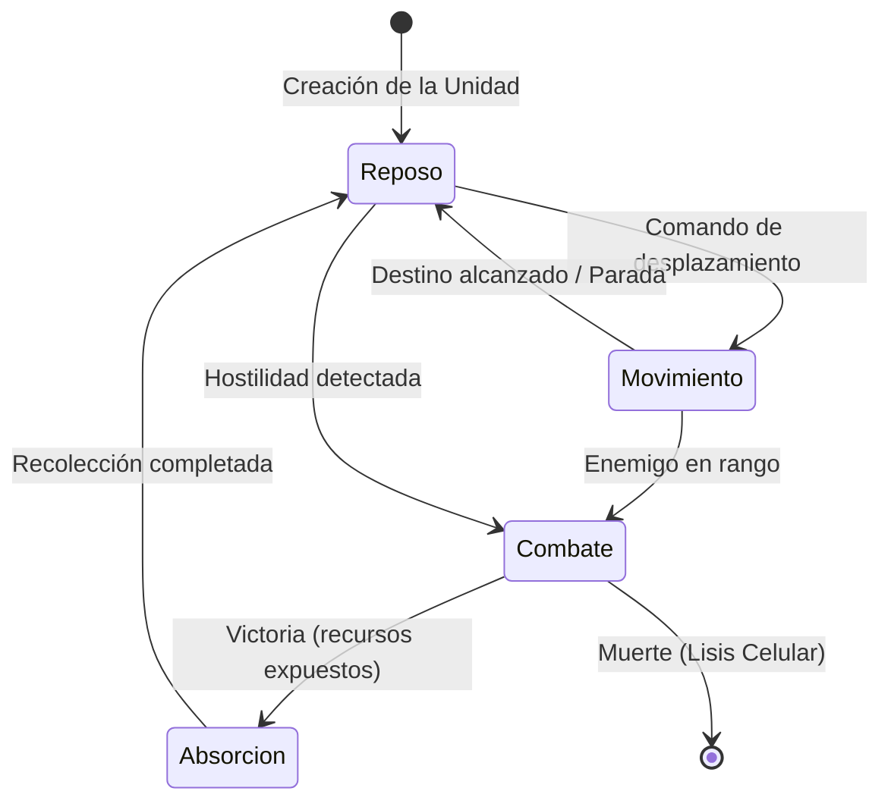

# Catálogo de Activos Visuales 2D y Guía de Pixel Art: TASK BAR 4X

Este documento define la dirección artística, las especificaciones técnicas y el catálogo completo de activos visuales en dos dimensiones (2D) y pixel art para **TASK BAR 4X**, un simulador de colonias e incremental a escala microscópica diseñado para ejecutarse en entornos compactos (como barras de tareas o ventanas flotantes).

---

## 1. Especificaciones Técnicas y Hojas de Sprites (Spritesheets)

Para garantizar la nitidez del arte en pantallas de alta densidad y evitar distorsiones durante el renderizado, se establecen las siguientes reglas técnicas de producción.

### 1.1 Hoja de Sprites para Recursos e Iconos de Interfaz (16x16 Píxeles)
*   **Tamaño de Celda:** 16x16 píxeles.
*   **Área Útil de Dibujo:** 14x14 píxeles centrados. Se debe mantener un margen de seguridad vacío de 1 píxel en todo el borde de la celda para prevenir el desbordamiento de texturas (*texture bleeding*) cuando se apliquen transformaciones de cámara o escalados en el motor gráfico.
*   **Formato de Archivo:** PNG de 24 bits con canal alfa de 8 bits (transparencia limpia).
*   **Estructura de la Hoja:** Cuadrículas contiguas sin espaciado externo. Las celdas se leen de izquierda a derecha y de arriba abajo.

### 1.2 Hoja de Sprites para Unidades y Estructuras (32x32 Píxeles)
*   **Tamaño de Celda:** 32x32 píxeles.
*   **Área de Colisión Física:** 24x24 píxeles centrados. Los píxeles periféricos se reservan para apéndices móviles como flagelos, cilios, pseudópodos, antenas, micro-cables o efectos de emisión lumínica.
*   **Distribución de Animaciones por Filas:** Cada fila de la hoja de sprites corresponde a un estado de animación específico para facilitar el direccionamiento por compensación (*offset*) en el motor:
    *   **Fila 0:** Reposo / Latido celular (*Idle*)
    *   **Fila 1:** Desplazamiento / Flagelo (*Walk*)
    *   **Fila 2:** Absorción / Fagocitosis / Recolección (*Harvest*)
    *   **Fila 3:** Combate / Lisis / Ataque (*Attack*)

```mermaid
grid-layout
  [Sprite 16x16: Recurso] --> [1px Margen] --> [14x14 Área Útil] --> [1px Margen]
  [Sprite 32x32: Unidad]  --> [Fila 0: Reposo]
  [Sprite 32x32: Unidad]  --> [Fila 1: Movimiento]
  [Sprite 32x32: Unidad]  --> [Fila 2: Absorción]
  [Sprite 32x32: Unidad]  --> [Fila 3: Ataque]
```

---

## 2. Dirección Artística General

El juego sigue una progresión celular, evolutiva y tecnológica que abarca 15 Edades. La estética transiciona desde lo puramente biológico y líquido en las primeras eras, pasa por la simbiosis, la especialización de tejidos, el extremismo químico y el parasitismo virulento, hasta culminar en la integración cibernética, la nanotecnología y la trascendencia física y cuántica.

### Directrices Clave de Diseño:
1.  **Alto Contraste:** Al ser un juego para barra de tareas, los sprites deben ser legibles a tamaños reducidos. Se utilizarán delineados oscuros (*outlines*) de un píxel, adaptando el color del delineado al tono predominante de la edad (en lugar de negro puro invariable).
2.  **Luminancia Selectiva:** Los recursos y núcleos celulares actuarán como puntos de luz. Los píxeles centrales de estas estructuras tendrán valores de brillo más altos para simular volumen e importancia visual.
3.  **Coherencia Cromática:** Cada Edad posee una paleta dominante de 6 colores clave que tiñe tanto el entorno como las unidades y las interfaces de esa era.

---

## 3. Catálogo Detallado de las 15 Edades y sus 6 Recursos

A continuación se detallan las 15 Edades de la colonia microscópica, sus paletas de colores representativas y el diseño pixelado de sus 6 recursos principales (generando los 90 iconos de recurso de la base de datos de producción).

---

### Edad 1: Prebiótica (La Sopa Primordial)
*Representa la formación de los primeros compuestos orgánicos en aguas termales y océanos primitivos.*
*   **Paleta de Color:**
    *   Fondo Oceánico: `#1D2D44` (Azul profundo)
    *   Limo Volcánico: `#4A2E2B` (Marrón cálido)
    *   Calor Térmico: `#D95D39` (Naranja óxido)
    *   Sustrato Mineral: `#7A9E7E` (Verde apagado)
    *   Nutrientes Primitivos: `#EAD2AC` (Crema orgánico)
    *   Reacción Chemical: `#3B7A75` (Turquesa sutil)

#### Recursos de la Edad 1 (16x16 píxeles)

| Recurso | Paleta de Colores | Silueta y Estilo | Guía de Pixelado |
| :--- | :--- | :--- | :--- |
| **1. Aminoácidos** | `#EAD2AC`, `#3B7A75` | Tres círculos unidos en ángulo de L. | Dibuja tres clusters de 2x2 píxeles solapados diagonalmente. Añade un píxel brillante en la intersección. |
| **2. Lípidos** | `#4A2E2B`, `#D95D39` | Esfera con una cola sinuosa. | Cabeza de 4x4 píxeles en marrón con centro naranja; cola sinuosa de 1 píxel de ancho que baja 5 píxeles. |
| **3. Nucleótidos** | `#3B7A75`, `#EAD2AC` | Estructura en forma de anillo con una pequeña saliente. | Círculo hueco de 5x5 píxeles con el centro transparente. Un píxel crema sobresale en la esquina superior derecha. |
| **4. Agua Termal** | `#1D2D44`, `#3B7A75` | Gota de agua clásica con una burbuja interior. | Silueta de gota de 5x7 píxeles. Relleno turquesa con un píxel azul marino en el centro simulando una vacuole de gas. |
| **5. Enzimas Primitivas** | `#7A9E7E`, `#4A2E2B` | Masa globular irregular con una hendidura. | Forma amorfa de 6x6 píxeles con una muesca de 2 píxeles de entrada en un lateral (sitio activo). |
| **6. Calor Volcánico** | `#D95D39`, `#EAD2AC` | Pequeña chispa o flama angular de tres puntas. | Base de 5 píxeles de ancho que se reduce a tres puntas verticales de 3 píxeles de altura con centro crema brillante. |

---

### Edad 2: Procariota (El Amanecer Celular)
*Aparición de las primeras células verdaderas sin núcleo, plásmidos libres y paredes protectoras de péptido-glucanos.*
*   **Paleta de Color:**
    *   Medio Bacteriano: `#1E5128` (Verde bosque)
    *   Citoplasma Procariota: `#4E9F3D` (Verde ácido)
    *   Material Genético: `#8E05C2` (Violeta nucleoide)
    *   Toxicidad / Fagos: `#3E065F` (Morado oscuro)
    *   Membrana Externa: `#00ADB5` (Cian eléctrico)
    *   Sustrato Nutritivo: `#EEEEEE` (Gris claro)

#### Recursos de la Edad 2 (16x16 píxeles)

| Recurso | Paleta de Colores | Silueta y Estilo | Guía de Pixelado |
| :--- | :--- | :--- | :--- |
| **7. ATP** | `#EEEEEE`, `#00ADB5` | Estrella diminuta de 4 puntas con destello central. | Cruz de 5x5 píxeles. El centro es cian brillante, las puntas son gris claro difuminado. |
| **8. ADN Circular** | `#8E05C2`, `#3E065F` | Círculo ovalado y retorcido (plásmido). | Anillo de 6x8 píxeles de grosor simple. Usa violeta para el anillo y morado para el sombreado inferior. |
| **9. Péptido-glucano** | `#00ADB5`, `#1E5128` | Fragmento de rejilla o malla entrelazada. | Cuadrícula de 6x6 píxeles con huecos intermedios de un píxel, simulando un tejido molecular rígido. |
| **10. Azufre Cristalino** | `#EEEEEE`, `#4E9F3D` | Rombo o cristal anguloso. | Rombo de 5x7 píxeles. Borde verde ácido con caras internas grisáceas y un brillo blanco en el ápice. |
| **11. Gradiente de Protones** | `#00ADB5`, `#8E05C2` | Dos esferas pequeñas unidas por una línea de fuerza. | Dos puntos de 2x2 píxeles (uno cian, uno violeta) separados por 3 píxeles vacíos y unidos por una línea discontinua. |
| **12. ARN Mensajero** | `#8E05C2`, `#EEEEEE` | Hebra lineal ondulada con dientes laterales. | Línea diagonal ondulada de 8 píxeles con pequeños puntos grises (bases) proyectándose de forma alternada. |

---

### Edad 3: Eucariota (La Revolución Interna)
*Desarrollo de compartimentos membranosos internos, núcleo verdadero y organelos especializados de procesamiento energético.*
*   **Paleta de Color:**
    *   Matriz Citoplasmática: `#EAE6E8` (Gris rosáceo translúcido)
    *   Membrana Nuclear: `#573395` (Morado real)
    *   Energía Mitocondrial: `#FF7597` (Rosa coral)
    *   Secreción / Golgi: `#FF8C32` (Naranja vibrante)
    *   Síntesis Ribosomal: `#FCDA05` (Amarillo oro)
    *   Cloroplasto Vegetativo: `#00D84A` (Verde clorofila)

#### Recursos de la Edad 3 (16x16 píxeles)

| Recurso | Paleta de Colores | Silueta y Estilo | Guía de Pixelado |
| :--- | :--- | :--- | :--- |
| **13. Citoplasma Gel** | `#EAE6E8`, `#FF7597` | Gota esférica semisólida y viscosa. | Círculo irregular de 6x6 píxeles con sombreado interno concéntrico. Tono rosa coral en el borde interno inferior. |
| **14. Mitocondria** | `#FF7597`, `#573395` | Óvalo en forma de cacahuete con líneas internas en zig-zag. | Silueta ovalada de 5x8 píxeles. Líneas horizontales de 3 píxeles de morado cruzando el interior rosa. |
| **15. Aparato de Golgi** | `#FF8C32`, `#FCDA05` | Capas curvas superpuestas como láminas de agua. | Tres líneas curvas concéntricas (grosor 1px) apiladas. Color naranja en la base y amarillo en el ápice. |
| **16. Glúcidos Complejos** | `#FCDA05`, `#FF8C32` | Estructura hexagonal doble (disacárido). | Dos hexágonos de 4x4 píxeles conectados por un píxel central en puente. Bordes definidos en amarillo. |
| **17. Bicapa Fosfolipídica**| `#573395`, `#EAE6E8` | Dos hileras opuestas de círculos con colas. | Dos líneas paralelas de esferas de 2x2 píxeles con colas internas que casi se tocan en el centro del sprite. |
| **18. Cromatina** | `#573395`, `#FF7597` | Hilos densos y enredados con forma de ovillo. | Maraña de píxeles morados y rosas en un área de 7x7 píxeles con espacios vacíos simulando el empaquetado del ADN. |

---

### Edad 4: Biofilm (La Colonia Primitiva)
*La transición biológica hacia la vida cooperativa. Creación de matrices de exopolisacáridos y comunicación por quórum.*
*   **Paleta de Color:**
    *   Base Mucilaginosa: `#634B35` (Marrón biofilm)
    *   Matriz Protectora: `#3D6B50` (Verde musgo)
    *   Humedad / Canales: `#4B9CD3` (Azul canal)
    *   Señalización: `#D9CE6B` (Amarillo pálido)
    *   Sustrato Adhesivo: `#D3A243` (Ámbar)
    *   Desecho Metabólico: `#8B9A93` (Gris verdoso)

#### Recursos de la Edad 4 (16x16 píxeles)

| Recurso | Paleta de Colores | Silueta y Estilo | Guía de Pixelado |
| :--- | :--- | :--- | :--- |
| **19. Matriz Polimérica**| `#3D6B50`, `#634B35` | Enrejado orgánico desordenado y fibroso. | Patrón de líneas cruzadas finas en verde musgo que cubre un área de 8x8 píxeles, con centros marrones oscuros. |
| **20. Autoinductores** | `#D9CE6B`, `#4B9CD3` | Pequeñas esferas concéntricas emitiendo ondas. | Punto central amarillo rodeado de un anillo discontinuo de píxeles azules simulando una onda de radio química. |
| **21. Nutriente Atrapado**| `#D3A243`, `#634B35` | Partícula brillante envuelta en una cápsula viscosa. | Centro ámbar brillante de 2x2 píxeles rodeado por una membrana difusa marrón de 6x6 píxeles de diámetro. |
| **22. Canalículo** | `#4B9CD3`, `#8B9A93` | Tubo ramificado de conducción de fluidos. | Dos líneas paralelas azules que se dividen en "Y" en la parte superior, con flujo interno gris claro. |
| **23. Exopolisacárido** | `#D3A243`, `#3D6B50` | Ramificaciones dendríticas pegajosas. | Estructura en forma de rama de árbol con extremos redondeados en ámbar y base en verde musgo. |
| **24. Enzimas Externas** | `#8B9A93`, `#D9CE6B` | Tijeras o pinzas moleculares flotantes. | Dos extensiones diagonales grises que convergen en un pivote amarillo brillante en la parte inferior del sprite. |

---

### Edad 5: Simbiótica (La Cooperación Organelar)
*Integración permanente de organismos independientes. Coevolución de plastidios y mecanismos de transporte selectivo.*
*   **Paleta de Color:**
    *   Mutualismo: `#4682B4` (Azul acero)
    *   Fotosíntesis Temprana: `#2E8B57` (Verde mar)
    *   Energía Compartida: `#FFD700` (Oro)
    *   Huésped Celular: `#FF7F50` (Coral)
    *   Parásito Tolerado: `#4B0082` (Indigo)
    *   Sustrato de Intercambio: `#556B2F` (Verde oliva oscuro)

#### Recursos de la Edad 5 (16x16 píxeles)

| Recurso | Paleta de Colores | Silueta y Estilo | Guía de Pixelado |
| :--- | :--- | :--- | :--- |
| **25. Plastidios** | `#2E8B57`, `#556B2F` | Disco biconvexo con discos internos apilados. | Óvalo horizontal de 7x4 píxeles verde mar con líneas verticales verde oliva simulando los tilacoides. |
| **26. Clorofila A** | `#2E8B57`, `#FFD700` | Anillo plano con una cola hidrofóbica larga. | Cabeza cuadrada de 3x3 píxeles verde mar con un centro dorado (magnesio) y cola vertical fina de 6 píxeles. |
| **27. Flujo Mutualista** | `#FFD700`, `#4682B4` | Dos flechas curvadas formando un círculo infinito. | Dos arcos de 1 píxel de grosor enfrentados (uno dorado, uno azul acero) simulando un ciclo de retroalimentación. |
| **28. Receptores de Enlace**| `#FF7F50`, `#4B0082` | Estructuras en forma de "llave y cerradura" acopladas. | Dos piezas geométricas (una coral en la base, otra índigo en la parte superior) que encajan perfectamente en el centro. |
| **29. Bombas de Membrana**| `#4682B4`, `#FF7F50` | Cilindro de canal con compuerta oscilante. | Dos bloques de 2x6 píxeles (azul) que flanquean un canal central. Un píxel coral sirve de compuerta inclinada. |
| **30. Simbiontes** | `#4B0082`, `#FFD700` | Pequeña célula englobada dentro de una vacuola. | Círculo índigo de 3x3 píxeles suspendido en una vacuola protectora de 7x7 píxeles con borde dorado difuso. |

---

### Edad 6: Pluricelular (La Especialización)
*Diferenciación celular formal, adhesión mecánica estructural y el nacimiento de tejidos coordinados rudimentarios.*
*   **Paleta de Color:**
    *   Matriz Tisular: `#FFB7B2` (Rosa carne pálido)
    *   Cohesión Estructural: `#6F2DBD` (Púrpura real)
    *   Flujo Nutritivo: `#E5383B` (Rojo sangre)
    *   Filtración Linfática: `#A8DADC` (Azul celeste)
    *   Soporte de Colágeno: `#F1FAEE` (Blanco hueso)
    *   Regulación: `#457B9D` (Azul acero oscuro)

#### Recursos de la Edad 6 (16x16 píxeles)

| Recurso | Paleta de Colores | Silueta y Estilo | Guía de Pixelado |
| :--- | :--- | :--- | :--- |
| **31. Fibras de Colágeno**| `#F1FAEE`, `#FFB7B2` | Haz de filamentos trenzados helicoidalmente. | Tres líneas diagonales blanco hueso entrelazadas y sombreadas en los bordes con rosa carne. |
| **32. Cadherinas** | `#6F2DBD`, `#457B9D` | Brazos o ganchos entrelazados en cremallera. | Dos peines laterales (uno púrpura, uno azul) cuyos dientes se alternan e intercalan en la columna central. |
| **33. Morfógenos** | `#457B9D`, `#FFB7B2` | Nube de difusión de partículas concéntricas. | Gradiente de píxeles dispersos que se condensan en el centro (azul oscuro) y se disipan en los bordes (rosa). |
| **34. Células Madre Micro**| `#FFB7B2`, `#6F2DBD` | Célula perfecta con núcleo gigante y brillante. | Círculo de 7x7 píxeles rosa carne con un núcleo púrpura de 3x3 que brilla intensamente en su centro. |
| **35. Oxígeno Libre** | `#A8DADC`, `#F1FAEE` | Par de esferas idénticas unidas firmemente. | Dos círculos adyacentes de 3x3 píxeles azul celeste con un píxel de brillo blanco en el cuadrante superior de cada uno. |
| **36. Glóbulos Nutrientes**| `#E5383B`, `#FFB7B2` | Discos bicóncavos en cadena. | Tres óvalos aplastados de 5x3 píxeles rojos en fila diagonal con el centro hundido y sombreado en rosa. |

---

### Edad 7: Quimiotrófica (Las Profundidades Extremas)
*Supervivencia en ambientes de alta presión y temperatura. Metabolismo de compuestos inorgánicos nocivos.*
*   **Paleta de Color:**
    *   Lecho de Basalto: `#1A1A1D` (Negro carbón)
    *   Azufre Reactivo: `#C39B22` (Amarillo azufre)
    *   Energía Magmática: `#C3073F` (Rojo fuego)
    *   Cristalización: `#4E4E50` (Gris basalto)
    *   Fluidos Hidrotermales: `#0F2027` (Azul abisal)
    *   Quimiosíntesis: `#203A43` (Verde sulfuroso)

#### Recursos de la Edad 7 (16x16 píxeles)

| Recurso | Paleta de Colores | Silueta y Estilo | Guía de Pixelado |
| :--- | :--- | :--- | :--- |
| **37. Sulfuro de Hidrógeno**| `#C39B22`, `#203A43` | Molécula angular pequeña con nubes gaseosas. | Un núcleo amarillo de 3x3 píxeles con dos esferas verdes de 1 píxel inclinadas a 104 grados. |
| **38. Metano** | `#203A43`, `#0F2027` | Molécula tetraédrica (cinco esferas unidas). | Una esfera central verde rodeada de cuatro esferas azul abisal en cruz tridimensional. |
| **39. Enzimas Extremas**| `#C3073F`, `#4E4E50` | Glóbulo compacto e intrincado con núcleo térmico. | Forma circular compacta de 7x7 píxeles gris basalto con venas de rojo fuego recorriendo su estructura. |
| **40. Pirita** | `#C39B22`, `#4E4E50` | Cubo perfecto con brillo metálico. | Cubo isométrico de 6x6 píxeles con aristas gris basalto y caras sombreadas en amarillo azufre dorado. |
| **41. Calor Geotérmico** | `#C3073F`, `#C39B22` | Fisura con eyección de plasma caliente. | Línea quebrada inferior negra de la cual emergen columnas verticales de píxeles rojo fuego y amarillo azufre. |
| **42. Iones Metálicos** | `#4E4E50`, `#C39B22` | Pequeños clústeres cristalinos flotantes. | Tres puntos aislados de 2x2 píxeles con un destello amarillo de un solo píxel en cada uno. |

---

### Edad 8: Fotosintética (La Captura Solar)
*Desarrollo de complejos de antena y centros de reacción. La atmósfera se inunda de oxígeno libre producto de la fotólisis.*
*   **Paleta de Color:**
    *   Luz Incidente: `#FFFFFF` (Blanco luz)
    *   Captación Lumínica: `#39FF14` (Verde fluorescente)
    *   Fijación de Carbono: `#00D672` (Esmeralda)
    *   Agua Solvente: `#0A192F` (Azul marino)
    *   Dióxido de Carbono: `#00E5FF` (Cian gas)
    *   Glucosa Primaria: `#FFF01F` (Amarillo solar)

#### Recursos de la Edad 8 (16x16 píxeles)

| Recurso | Paleta de Colores | Silueta y Estilo | Guía de Pixelado |
| :--- | :--- | :--- | :--- |
| **43. Fotones** | `#FFFFFF`, `#FFF01F` | Ondas o rayos angulares descendentes. | Líneas diagonales discontinuas amarillas y blancas de 1 píxel que cruzan el lienzo de arriba abajo. |
| **44. Burbujas de O2** | `#FFFFFF`, `#00E5FF` | Esferas transparentes y flotantes con brillo. | Anillo de 5x5 píxeles cian con interior transparente y un único píxel blanco de reflejo en la esquina superior izquierda. |
| **45. Dióxido de Carbono**| `#00E5FF`, `#0A192F` | Tres esferas alineadas (lineal). | Fila de tres círculos de 3x3 píxeles. El del medio es azul marino (carbono), los extremos son cian (oxígenos). |
| **46. Complejo RuBisCO** | `#00D672`, `#39FF14` | Proteína globular de 8 simetrías (flor gigante). | Octágono de 8x8 píxeles verde esmeralda con un patrón radial de puntas verde fluorescente. |
| **47. Glucosa** | `#FFF01F`, `#00D672` | Anillo hexagonal regular de azúcar. | Hexágono de 6x6 píxeles con bordes amarillos y un centro esmeralda semi-transparente. |
| **48. Agua Molecular** | `#00E5FF`, `#0A192F` | Forma de "cabeza de ratón" clásica. | Una esfera central azul de 3x3 píxeles con dos esferas cian de 2x2 píxeles acopladas lateralmente. |

---

### Edad 9: Patógena (La Invasión)
*Aparición de entidades de replicación forzada (fagos y viriones) y toxinas destructoras de membranas anfitrionas.*
*   **Paleta de Color:**
    *   Medio Infectado: `#353535` (Gris necrosis)
    *   Cápside Vírica: `#800808` (Rojo sangre oscuro)
    *   Toxina Celular: `#D92027` (Rojo escarlata)
    *   Lisis Inducida: `#F88F01` (Naranja fuego)
    *   Virulencia / Pilosidades: `#39FF14` (Verde ponzoña)
    *   Ácido Nucleico Parásito: `#5F093D` (Fucsia oscuro)

#### Recursos de la Edad 9 (16x16 píxeles)

| Recurso | Paleta de Colores | Silueta y Estilo | Guía de Pixelado |
| :--- | :--- | :--- | :--- |
| **49. Viriones** | `#800808`, `#39FF14` | Icosaedro con patas cortas (fago). | Cabeza hexagonal de 5x5 píxeles roja con tres patas delgadas de 1 píxel (verde ponzoña) en la base. |
| **50. Toxina Lítica** | `#D92027`, `#353535` | Gota afilada con halo corrosivo. | Gota vertical de 4x7 píxeles rojo escarlata rodeada por una neblina de píxeles grises dispersos. |
| **51. Espículas de Invasión**| `#39FF14`, `#800808` | Arpones o ganchos moleculares. | Línea de 6 píxeles de longitud terminada en una punta de flecha o ancla de 3 píxeles de ancho. Verde brillante. |
| **52. Receptores Infectados**| `#F88F01`, `#5F093D` | Cerradura rota o receptor colapsado. | Estructura de membrana hendida en naranja fuego con un filamento fucsia atravesándola por la fuerza. |
| **53. Membrana Robada** | `#800808`, `#F88F01` | Fragmentos de membrana rasgados. | Línea discontinua y zigzagueante de píxeles rojos y naranjas simulando una bicapa celular rota. |
| **54. Enzimas Perforadoras**| `#5F093D`, `#D92027` | Micro-taladros o punzones de proteínas. | Punta cónica de 3x6 píxeles fucsia con base de apoyo escarlata, orientada hacia abajo. |

---

### Edad 10: Bio-Mecánica (La Ciber-Célula)
*Primeros injertos sintéticos estables. Electrodos biológicos que canalizan impulsos eléctricos celulares.*
*   **Paleta de Color:**
    *   Chasis Orgánico: `#121212` (Negro profundo)
    *   Fibra Conductora: `#888888` (Gris metal)
    *   Impulso Bio-Eléctrico: `#00FF66` (Verde terminal)
    *   Láser / Sensor: `#FF0055` (Rojo láser)
    *   Semiconductor Orgánico: `#00E5FF` (Azul cian ciber)
    *   Punto de Soldadura: `#FFD700` (Oro metálico)

#### Recursos de la Edad 10 (16x16 píxeles)

| Recurso | Paleta de Colores | Silueta y Estilo | Guía de Pixelado |
| :--- | :--- | :--- | :--- |
| **55. Electrodos Orgánicos**| `#888888`, `#FFD700` | Aguja metálica con cabeza de contacto. | Barra vertical gris de 1x7 píxeles rematada en un terminal esférico dorado de 3x3 píxeles. |
| **56. Bio-Silicio** | `#00E5FF`, `#121212` | Plaqueta rectangular micro con pistas de luz. | Rectángulo de 6x4 píxeles azul ciber con una línea interna negra simulando un canal de circuito. |
| **57. Micro-Cables** | `#888888`, `#00FF66` | Cables trenzados con chispas eléctricas. | Dos líneas paralelas grises horizontales con píxeles verdes aleatorios (corriente) saltando entre ellas. |
| **58. Enzimas de Platino** | `#888888`, `#FF0055` | Esfera metálica con núcleo catalítico láser. | Círculo gris de 6x6 píxeles con un centro rojo láser brillante de un solo píxel altamente de gran brillo. |
| **59. Impulso Nervioso** | `#00FF66`, `#121212` | Onda oscilante (electrocardiograma micro). | Línea sinusoidal verde de 1 píxel con picos altos y valles que cruza horizontalmente el sprite. |
| **60. Puntos Cuánticos** | `#FFD700`, `#00E5FF` | Matriz de microesferas ordenadas. | Cuatro puntos dorados y cian de 2x2 píxeles colocados en los cuatro extremos de la celda de dibujo. |

---

### Edad 11: Nanotecnológica (Los Ensambladores)
*Sistemas de manipulación atómica y motores moleculares que fabrican estructuras complejas desde cero.*
*   **Paleta de Color:**
    *   Carcasa de Titanio: `#EAEAEA` (Plata brillante)
    *   Flujo Lógico: `#0052D4` (Azul cobalto)
    *   Haz de Datos: `#4364F7` (Azul cian)
    *   Alerta de Sistema: `#FF416C` (Rojo neón)
    *   Estructura Molecular: `#232526` (Negro grafito)
    *   Haz de Control: `#FFFFFF` (Blanco absoluto)

#### Recursos de la Edad 11 (16x16 píxeles)

| Recurso | Paleta de Colores | Silueta y Estilo | Guía de Pixelado |
| :--- | :--- | :--- | :--- |
| **61. Nanotubos** | `#232526`, `#EAEAEA` | Cilindro de malla de carbono tridimensional. | Cilindro diagonal de 4 píxeles de diámetro hecho con un patrón de red gris grafito y bordes plateados. |
| **62. Rotores Moleculares**| `#EAEAEA`, `#0052D4` | Hélice de tres aspas unida a un eje. | Eje central azul cobalto de 2x2 píxeles con tres aspas plateadas curvas de 4 píxeles de longitud cada una. |
| **63. Micro-Baterías** | `#EAEAEA`, `#FF416C` | Pila cilíndrica con medidor de energía. | Cápsula vertical de 5x8 píxeles plateada con una barra interna roja que sube según la carga. |
| **64. Matriz Programable** | `#232526`, `#4364F7` | Red de nodos cuadrados lógicos. | Tres cuadrados de 3x3 píxeles negros conectados por líneas cian de 1 píxel de ancho. |
| **65. Nano-Sondas** | `#EAEAEA`, `#FFFFFF` | Aguja cónica con punta emisora de luz. | Cono plateado apuntando hacia abajo con un destello blanco brillante de 2x2 píxeles en el extremo. |
| **66. Bloques de Carbono** | `#232526`, `#EAEAEA` | Cubos moleculares modulares de ensamblaje. | Estructura tridimensional formada por tres cubos negros acoplados con bordes resaltados en plata. |

---

### Edad 12: Cuántica (La Superposición)
*Manipulación celular basada en la dualidad onda-partícula y el entrelazamiento de estados subatómicos.*
*   **Paleta de Color:**
    *   Vórtice Cuántico: `#8A2387` (Violeta místico)
    *   Entrelazamiento: `#E94057` (Rosa cuántico)
    *   Orientación de Espín: `#F27121` (Naranja espín)
    *   Nivel de Energía: `#0F2027` (Azul noche)
    *   Fluctuación de Vacío: `#203A43` (Turquesa oscuro)
    *   Probabilidad Cuántica: `#FFFFFF` (Blanco)

#### Recursos de la Edad 12 (16x16 píxeles)

| Recurso | Paleta de Colores | Silueta y Estilo | Guía de Pixelado |
| :--- | :--- | :--- | :--- |
| **67. Ondas Armónicas** | `#FFFFFF`, `#8A2387` | Interferencia de ondas sinusoidales. | Dos líneas onduladas finas que se cruzan y crean zonas de luz blanca y sombra violeta. |
| **68. Vectores de Espín** | `#F27121`, `#0F2027` | Esfera con flechas orbitales dobles. | Círculo azul noche de 5x5 píxeles con una flecha naranja curvada que lo rodea por arriba y por abajo. |
| **69. Hilos Entrelazados** | `#E94057`, `#8A2387` | Dos partículas unidas por un puente de luz. | Dos esferas rosa de 3x3 píxeles en esquinas opuestas conectadas por una línea discontinua violeta. |
| **70. Fluctuaciones** | `#203A43`, `#FFFFFF` | Nube de partículas evanescentes. | Nube dispersa e irregular de píxeles blancos que decrece hacia un fondo turquesa oscuro. |
| **71. Microtúneles** | `#8A2387`, `#F27121` | Agujero de gusano microscópico. | Espiral concéntrica violeta de 8x8 píxeles con un núcleo naranja de alta energía en el centro exacto. |
| **72. Bio-Qubits** | `#FFFFFF`, `#0F2027` | Cubos transparentes con estados superpuestos (0/1). | Cubo isométrico blanco de aristas de 1px con un centro azul noche que cambia de intensidad. |

---

### Edad 13: Inmunidad Absoluta (La Fortaleza Celular)
*El apogeo de la defensa biológica. Redes inmunológicas infalibles, tijeras CRISPR automáticas y membranas blindadas.*
*   **Paleta de Color:**
    *   Muro del Bastión: `#F3F9FB` (Blanco escudo)
    *   Barrera Defensiva: `#00B4DB` (Cian defensivo)
    *   Anticuerpo Activo: `#0083B0` (Azul marino real)
    *   Núcleo Protector: `#FFDF00` (Oro puro)
    *   Placa Sintética: `#757F9A` (Gris acero)
    *   Regeneración Rápida: `#D7DDE8` (Plateado suave)

#### Recursos de la Edad 13 (16x16 píxeles)

| Recurso | Paleta de Colores | Silueta y Estilo | Guía de Pixelado |
| :--- | :--- | :--- | :--- |
| **73. Anticuerpos Y** | `#0083B0`, `#F3F9FB` | Bifurcación en forma de "Y" invertida. | Estructura en "Y" con base de 2 píxeles de grosor y brazos superiores terminados en puntas blancas. |
| **74. Receptores T** | `#00B4DB`, `#757F9A` | Escudo con espícula de anclaje defensivo. | Escudo circular de 6x6 píxeles cian con una base metálica gris que se introduce en la membrana. |
| **75. Guías CRISPR** | `#FFDF00`, `#0083B0` | Tijeras moleculares cortando una cinta. | Dos hojas cruzadas doradas (tijeras) que se cierran sobre una hebra lineal de ADN azul marino. |
| **76. Nano-Vacunas** | `#F3F9FB`, `#D7DDE8` | Esferas concéntricas blindadas. | Círculo plateado de 6x6 píxeles con un núcleo blanco escudo y un reborde exterior muy brillante. |
| **77. Interferón** | `#00B4DB`, `#FFDF00` | Nube de señales de alerta de alta visibilidad. | Corona de espinas o estrellas doradas y cianes que irradian desde un núcleo central vacío. |
| **78. Placas Lipídicas** | `#757F9A`, `#D7DDE8` | Placas hexagonales de blindaje de membrana. | Loseta hexagonal plana de 6x5 píxeles gris acero con biseles plateados de alto brillo. |

---

### Edad 14: Macro-Emergencia (El Salto de Escala)
*Desarrollo de los primeros exoesqueletos, sensores mecánicos de gravedad y tejidos preparados para el macro-mundo.*
*   **Paleta de Color:**
    *   Humedad Terrestre: `#5C3D2E` (Marrón tierra)
    *   Tejido Clorofílico: `#1A4314` (Verde bosque profundo)
    *   Exoesqueleto: `#B85C38` (Ocre quitina)
    *   Frontera Gaseosa: `#00D2FC` (Celeste atmósfera)
    *   Soporte Físico: `#475569` (Gris piedra)
    *   Nutrición Aérea: `#F4D160` (Polen)

#### Recursos de la Edad 14 (16x16 píxeles)

| Recurso | Paleta de Colores | Silueta y Estilo | Guía de Pixelado |
| :--- | :--- | :--- | :--- |
| **79. Andamios 3D** | `#475569`, `#5C3D2E` | Estructura cúbica de soporte arquitectónico. | Esqueleto cúbico isométrico en gris piedra con sombreado de suelo en marrón tierra. |
| **80. Hormonas Macro** | `#F4D160`, `#1A4314` | Gotas doradas suspendidas. | Gota vertical de 5x7 píxeles amarillo polen con un núcleo interno verde bosque. |
| **81. Quitina** | `#B85C38`, `#5C3D2E` | Placas curvas superpuestas. | Tres arcos horizontales ocre quitina apilados como tejas, sombreados con marrón tierra. |
| **82. Fibras Estriadas** | `#1A4314`, `#475569` | Haces de filamentos musculares. | Líneas verticales gruesas verdes con bandas transversales grises simulando estrías de contracción. |
| **83. Estatolitos** | `#475569`, `#F4D160` | Esfera con partículas pesadas que caen. | Cámara circular gris con tres píxeles dorados en el fondo representando sensores de gravedad. |
| **84. Polen** | `#F4D160`, `#00D2FC` | Esfera espinosa flotante. | Círculo amarillo de 5x5 píxeles con espinas de un solo píxel celeste que sobresalen en todas direcciones. |

---

### Edad 15: Trascendencia Escalar (La Mente Enjambre)
*Unificación definitiva de las escalas cuánticas y macroscópicas en una red biológica global consciente e infinita.*
*   **Paleta de Color:**
    *   Consciencia Global: `#FFE000` (Oro místico)
    *   Fluido Trascendente: `#7F00FF` (Púrpura cósmico)
    *   Frecuencia Astral: `#E100FF` (Fucsia dimensional)
    *   Red Neural Planetaria: `#00F2FE` (Azul éter)
    *   Vacío Absoluto: `#FFFFFF` (Blanco puro)
    *   Efecto de Emisión: `#FF007F` (Rosa energía)

#### Recursos de la Edad 15 (16x16 píxeles)

| Recurso | Paleta de Colores | Silueta y Estilo | Guía de Pixelado |
| :--- | :--- | :--- | :--- |
| **85. Consciencia Central**| `#FFE000`, `#FFFFFF` | Núcleo divino flotante con corona de luz. | Círculo blanco de 4x4 píxeles envuelto en un aura de oro místico en forma de cruz brillante. |
| **86. Bytes Orgánicos** | `#00F2FE`, `#7F00FF` | Flujo de datos biológicos (código y células). | Columna de 3x8 píxeles azul éter con interrupciones y destellos en púrpura cósmico. |
| **87. Nodos de la Red** | `#00F2FE`, `#E100FF` | Hexágono con conexiones multidireccionales. | Hexágono central azul con líneas radiales fucsias saliendo de sus 6 vértices hacia los bordes. |
| **88. Plasma Lumínico** | `#FF007F`, `#FFE000` | Esfera de energía pura inmaterial. | Esfera difusa rosa energía con un centro caliente de gran brillo cromático dorado. |
| **89. Polvo de Éter** | `#FFFFFF`, `#E100FF` | Clústeres de estrellas microscópicas. | Dispersión de píxeles individuales blancos y fucsias imitando polvo estelar sobre fondo oscuro. |
| **90. Espiral de Escala** | `#7F00FF`, `#00F2FE` | Espiral infinita (Fractal micro-macro). | Espiral de 8x8 píxeles que converge en el centro del sprite alternando púrpura y azul éter. |

---

## 4. Guía de Animación de Unidades y Estructuras (32x32 Píxeles)

Las unidades celulares y nanotecnológicas de TASK BAR 4X se animan mediante secuencias de fotogramas clave (*spritesheets* horizontales). A continuación se definen los parámetros mecánicos y visuales para los cuatro estados esenciales.

### 4.1 Máquina de Estados de Animación (Flujo)



---

### 4.2 Especificación de Estados y Fotogramas

#### 1. Reposo / Latido Celular (*Idle*)
*   **Propósito:** Indicar vitalidad sin desplazamiento.
*   **Número de Fotogramas:** 4 fotogramas en bucle continuo (*ping-pong* o circular).
*   **Mecánica Visual:** La célula realiza una expansión volumétrica del 10% en los ejes X/Y y una contracción correspondiente.
*   **Secuencia de Diseño (32x32):**
    *   **Frame 1:** Silueta base (esfera o elipse regular).
    *   **Frame 2:** Expansión lateral (1px más ancha, 1px más baja).
    *   **Frame 3:** Expansión vertical (1px más estrecha, 1px más alta).
    *   **Frame 4:** Retorno a silueta base.
*   **Velocidad de Animación:** 120 ms por fotograma (Ciclo completo: 480 ms).

#### 2. Desplazamiento / Movimiento Flagelar (*Walk*)
*   **Propósito:** Traslación por el entorno acuoso o mecánico.
*   **Número de Fotogramas:** 6 fotogramas en bucle circular.
*   **Mecánica Visual:** Deformación ameboide del cuerpo principal (inclinación en la dirección de la marcha) combinada con la oscilación sinusoidal de flagelos o cilios.
*   **Secuencia de Diseño (32x32):**
    *   **Frame 1:** Cuerpo inclinado hacia adelante; flagelo recto en el eje posterior.
    *   **Frame 2:** Flagelo forma una curva hacia arriba; cuerpo se estira.
    *   **Frame 3:** Flagelo en máxima flexión; contracción del cuerpo.
    *   **Frame 4:** Flagelo regresa al centro; cuerpo se estira.
    *   **Frame 5:** Flagelo curva hacia abajo.
    *   **Frame 6:** Flagelo inicia el retorno; cuerpo se estabiliza.
*   **Velocidad de Animación:** 80 ms por fotograma (Ciclo completo: 480 ms).

#### 3. Absorción / Fagocitosis (*Harvest*)
*   **Propósito:** Extracción y digestión de los recursos de la edad.
*   **Número de Fotogramas:** 8 fotogramas (Animación de acción unitaria con retorno al reposo).
*   **Mecánica Visual:** Extensión de pseudópodos hacia el recurso, envoltura del mismo dentro de una vacuola y asimilación con destello luminoso.
*   **Secuencia de Diseño (32x32):**
    *   **Frame 1-2 (Extensión):** La membrana se deforma proyectando dos brazos celulares hacia el exterior.
    *   **Frame 3-4 (Captura):** Los brazos rodean una representación miniatura del recurso.
    *   **Frame 5-6 (Fagocitosis):** Los brazos se cierran, el recurso es absorbido y la membrana se sella.
    *   **Frame 7 (Digestión):** Un pulso de luz (color de energía de la edad) recorre el interior de la unidad.
    *   **Frame 8 (Retorno):** Reajuste de la forma celular al estado de reposo.
*   **Velocidad de Animación:** 100 ms por fotograma (Ciclo completo: 800 ms).

#### 4. Combate / Lisis Inducida (*Attack*)
*   **Propósito:** Dañar o lisar células rivales.
*   **Número de Fotogramas:** 6 fotogramas (Animación rápida con anticipación e impacto).
*   **Mecánica Visual:** Carga de energía o contracción extrema seguida de una proyección rápida (estocada física, disparo de toxinas o filamentos ejectables).
*   **Secuencia de Diseño (32x32):**
    *   **Frame 1 (Anticipación):** La unidad se comprime hacia atrás y brilla en su color de ataque.
    *   **Frame 2 (Carga):** Los orgánulos ofensivos se alinean en la dirección del objetivo.
    *   **Frame 3 (Impacto):** Proyección instantánea (un aguijón de membrana o descarga de 8 píxeles de longitud).
    *   **Frame 4 (Contacto):** Destello en el punto de colisión; micropartículas de desecho se desprenden del objetivo.
    *   **Frame 5 (Retracción):** El arma ofensiva se retrae rápidamente.
    *   **Frame 6 (Recuperación):** Reajuste general de la forma de la unidad.
*   **Velocidad de Animación:** 60 ms por fotograma (Ciclo completo: 360 ms).

---

## 5. Recomendaciones de Implementación para Programadores

Para los desarrolladores de **TASK BAR 4X**, se aconseja aplicar las siguientes configuraciones en el motor de renderizado 2D:

1.  **Filtrado de Textura:** Desactivar el filtro bilineal o trilineal. Utilizar exclusivamente **Filtro por Vecino Más Próximo** (*Nearest Neighbor*) para mantener la dureza y claridad de los píxeles individuales al escalar.
2.  **Escalado Entero:** Escalar los sprites únicamente en múltiplos enteros ($2\times$, $3\times$, $4\times$) para evitar artefactos visuales o deformaciones en la relación de aspecto de los píxeles (*pixel warping*).
3.  **Partículas de Desecho:** Al destruir unidades (lisis celular) o recolectar recursos, instanciar un sistema de partículas simple que emita bloques de 1x1 y 2x2 píxeles coloreados con la paleta específica de la Edad activa. Esto refuerza el dinamismo visual del juego incremental.
