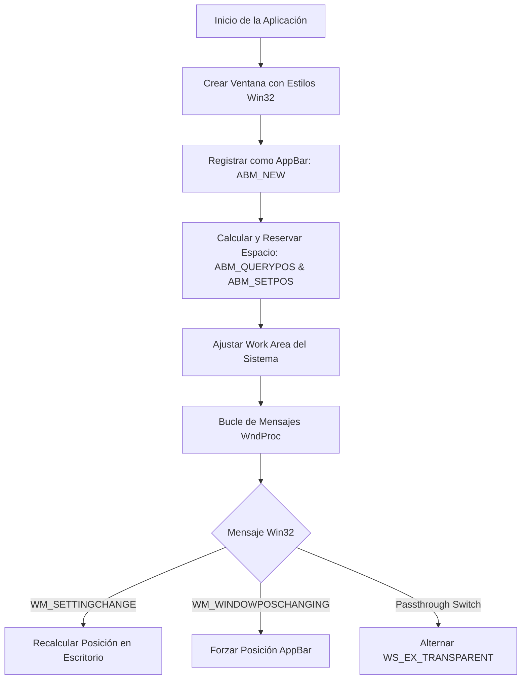
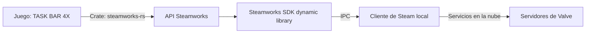
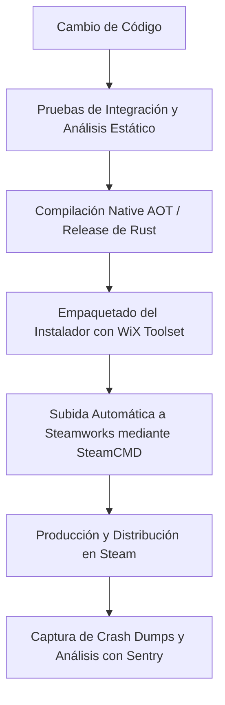

# Guía de Ingeniería de Software: Desarrollo de Videojuegos en la Barra de Tareas de Windows (TASK BAR 4X)

Esta guía detalla los aspectos críticos de ingeniería, arquitectura de software y optimización a bajo nivel necesarios para construir un videojuego estable, interactivo y de consumo ultra-bajo que se integre directamente en la barra de tareas de Microsoft Windows.

---

## 1. Evaluación y Selección de la Pila Tecnológica

La naturaleza de un juego integrado en la barra de tareas (como *TASK BAR 4X*) impone restricciones de recursos extremadamente estrictas: el usuario espera que el juego coexista con sus herramientas de trabajo y juegos principales sin degradar el rendimiento del sistema.

### Comparativa de Pilas Tecnológicas

| Criterio | Rust Nativo + Direct2D / wgpu | Rust + Tauri (Webview2) | C#/.NET 9 (Native AOT + Win32) | Godot / Unity (Modo Transparente) |
| :--- | :--- | :--- | :--- | :--- |
| **Consumo de RAM** | **Ultra-bajo (< 10-15 MB)** | Moderado-Alto (70-120 MB) | Bajo-Moderado (25-45 MB) | Alto (> 120 MB) |
| **Uso de CPU (Reposo)** | **~0.0% (Bloqueo por eventos)** | ~0.5% - 2.0% (Bucle Chromium) | ~0.1% (Bucle Win32) | ~1.5% - 5.0% (Bucle activo) |
| **Tamaño del Binario** | ~2 - 5 MB | ~10 - 15 MB | ~5 - 10 MB | > 50 MB |
| **Acceso a API Win32** | Nativo directo e inmediato | A través de IPC/Bindings | Nativo mediante P/Invoke | Limitado / Requiere C++ Plugins |
| **Paso de Clics dinámico** | Directo en el bucle principal | Complejo a través de IPC | Directo mediante WndProc | Difícil de sincronizar |

### Análisis Técnico de Viabilidad

1. **Rust + Tauri (Webview2)**:
   Aunque Tauri ofrece un entorno de desarrollo web moderno, la infraestructura subyacente depende de Microsoft Edge WebView2 (Chromium). Cada instancia de WebView2 inicia múltiples procesos en Windows (proceso del navegador, proceso de GPU, proceso de renderizado y proceso de red). Es virtualmente imposible garantizar un consumo de memoria RAM inferior a 40 MB de forma sostenida bajo este esquema.
2. **Motores de Juego (Godot / Unity)**:
   Estos motores están diseñados para renderizar de forma activa (bucle de renderizado continuo) a tasas de refresco altas. Incluso en modo de bajo consumo, la sobrecarga del recolector de basura (Unity/C#), la inicialización de sistemas de audio, física tridimensional y pipelines de renderizado modernos hacen inviable el cumplimiento de los límites de memoria y uso de CPU.
3. **C#/.NET 9 con Native AOT**:
   Es una opción viable si se implementa una interfaz gráfica ligera usando Windows Forms o llamadas directas a GDI+/Direct2D, compilando con Native AOT para eliminar la sobrecarga de la máquina virtual del CLR. Sin embargo, carece del control granular de memoria y la seguridad en concurrencia que proporciona Rust.
4. **Rust Nativo (Arquitectura Recomendada)**:
   La arquitectura óptima para *TASK BAR 4X* es una aplicación nativa en Rust que utilice directamente la API de Windows mediante los crates `windows` o `windows-sys`. Para la interfaz y lógica de juego, se emplea **Direct2D** (o un backend ligero de **wgpu** configurado bajo demanda) junto con un gestor de ventanas ligero como `winit` o la API Win32 pura. Esto permite un consumo en reposo de ~10 MB de RAM y un uso de CPU prácticamente inexistente (0.0% cuando no hay interacción).

---

## 2. Integración Profunda con la API Win32 de Windows

Para comportarse como una barra de herramientas del sistema (Application Desktop Toolbar o *AppBar*), la ventana del juego debe registrarse en el sistema operativo y gestionar el espacio de trabajo del escritorio de forma dinámica.



### Configuración del Registro como AppBar

El registro de una ventana como AppBar notifica al explorador de Windows que debe reservar un área de la pantalla exclusiva para la aplicación, evitando que otras ventanas maximizadas se superpongan a ella. Esto se realiza mediante la API `SHAppBarMessage`.

A continuación se presenta la implementación de la inicialización y posicionamiento en Rust utilizando el crate `windows`:

```rust
use windows::Win32::UI::Shell::{
    SHAppBarMessage, APB_SETPOS, APB_QUERYPOS, ABM_NEW, ABM_REMOVE,
    APPBARDATA, ABE_BOTTOM
};
use windows::Win32::Foundation::{HWND, RECT, LPARAM, LRESULT, WPARAM};
use windows::Win32::UI::WindowsAndMessaging::{
    GetSystemMetrics, SM_CXSCREEN, SM_CYSCREEN, SetWindowPos, SWP_NOACTIVATE, SWP_SHOWWINDOW
};

pub unsafe fn registrar_appbar(hwnd: HWND, altura_deseada: i32) -> RECT {
    let mut abd = APPBARDATA {
        cbSize: std::mem::size_of::<APPBARDATA>() as u32,
        hWnd: hwnd,
        uCallbackMessage: 0, // Definir mensaje personalizado si se requieren notificaciones
        uEdge: ABE_BOTTOM as u32,
        rc: RECT::default(),
        lParam: LPARAM(0),
    };

    // 1. Registrar la AppBar en el sistema
    SHAppBarMessage(ABM_NEW, &mut abd);

    // 2. Definir la posición propuesta (en la parte inferior de la pantalla principal)
    let screen_width = GetSystemMetrics(SM_CXSCREEN);
    let screen_height = GetSystemMetrics(SM_CYSCREEN);

    abd.rc = RECT {
        left: 0,
        top: screen_height - altura_deseada,
        right: screen_width,
        bottom: screen_height,
    };

    // 3. Consultar al sistema si la posición está disponible
    SHAppBarMessage(ABM_QUERYPOS, &mut abd);

    // 4. Confirmar y establecer la posición final calculada por el sistema
    SHAppBarMessage(ABM_SETPOS, &mut abd);

    // 5. Ajustar físicamente la ventana a las coordenadas otorgadas
    SetWindowPos(
        hwnd,
        HWND(0),
        abd.rc.left,
        abd.rc.top,
        abd.rc.right - abd.rc.left,
        abd.rc.bottom - abd.rc.top,
        SWP_NOACTIVATE | SWP_SHOWWINDOW,
    ).expect("Error al posicionar la ventana de la AppBar");

    abd.rc
}

pub unsafe fn eliminar_appbar(hwnd: HWND) {
    let mut abd = APPBARDATA {
        cbSize: std::mem::size_of::<APPBARDATA>() as u32,
        hWnd: hwnd,
        ..Default::default()
    };
    SHAppBarMessage(ABM_REMOVE, &mut abd);
}
```

### Estilos Extendidos de Ventana (Estilos de Ventana de Interfaz de Usuario)

Para que el juego funcione sin interrumpir el flujo de trabajo del usuario, la ventana debe tener propiedades específicas aplicadas a través de sus estilos extendidos (`WS_EX`):

*   **`WS_EX_NOACTIVATE`**: Evita que la ventana del juego tome el foco de entrada del teclado del usuario cuando hace clic sobre ella. El usuario puede seguir escribiendo en su editor de código o navegador mientras interactúa con el juego en la barra de tareas.
*   **`WS_EX_TOOLWINDOW`**: Evita que la aplicación aparezca en la barra de tareas estándar de Windows o en el diálogo de cambio de aplicación (Alt+Tab), comportándose de manera idéntica a una utilidad integrada del sistema.
*   **`WS_EX_LAYERED`**: Habilita la transparencia por píxel de la ventana, permitiendo que las áreas transparentes del lienzo muestren el fondo de pantalla o la barra de tareas real.

Al crear la ventana, el registro de estilos en Rust se define de la siguiente manera:

```rust
use windows::Win32::UI::WindowsAndMessaging::{
    CreateWindowExW, WS_EX_NOACTIVATE, WS_EX_TOOLWINDOW, WS_EX_LAYERED, WS_EX_TRANSPARENT,
    WS_POPUP, CW_USEDEFAULT
};

// Creación de ventana transparente, sin foco y persistente
let ex_style = WS_EX_NOACTIVATE | WS_EX_TOOLWINDOW | WS_EX_LAYERED;
let style = WS_POPUP; // Ventana sin bordes decorativos
```

### Mecanismo Dinámico de Clics Passthrough (Clics a través de la Ventana)

En un juego interactivo de barra de tareas, habrá zonas vacías o transparentes donde el usuario querrá hacer clic en los iconos reales del escritorio o interactuar con otras aplicaciones detrás del juego. 

Para lograr esto, la ventana debe alternar dinámicamente el estilo extendido `WS_EX_TRANSPARENT`:
*   Cuando el cursor está sobre un elemento activo del juego (un menú, una unidad o una estructura), se **remueve** `WS_EX_TRANSPARENT` para recibir el clic.
*   Cuando el cursor está sobre el espacio vacío del lienzo, se **añade** `WS_EX_TRANSPARENT`, haciendo que el sistema operativo ignore la ventana del juego y envíe el evento de clic a la ventana que se encuentra detrás.

```rust
use windows::Win32::UI::WindowsAndMessaging::{
    GetWindowLongPtrW, SetWindowLongPtrW, GWL_EXSTYLE, SWP_NOMOVE, SWP_NOSIZE, SWP_NOZORDER, SWP_FRAMECHANGED
};

pub unsafe fn establecer_modo_passthrough(hwnd: HWND, transparente: bool) {
    let estilo_actual = GetWindowLongPtrW(hwnd, GWL_EXSTYLE) as u32;
    let nuevo_estilo = if transparente {
        estilo_actual | WS_EX_TRANSPARENT.0
    } else {
        estilo_actual & !WS_EX_TRANSPARENT.0
    };
    
    if estilo_actual != nuevo_estilo {
        SetWindowLongPtrW(hwnd, GWL_EXSTYLE, nuevo_estilo as isize);
        // Forzar actualización de los estilos de la ventana de inmediato
        SetWindowPos(
            hwnd,
            HWND(0),
            0, 0, 0, 0,
            SWP_NOACTIVATE | SWP_NOMOVE | SWP_NOSIZE | SWP_NOZORDER | SWP_FRAMECHANGED,
        ).ok();
    }
}
```

### Soporte Multimonitor y Redimensión Dinámica

El escritorio de Windows es dinámico; el usuario puede cambiar la resolución de pantalla, conectar un nuevo monitor o cambiar la barra de tareas de posición. La aplicación debe escuchar el mensaje `WM_SETTINGCHANGE` en su procedimiento de ventana (`WndProc`) para recalcular su área de trabajo.

```rust
unsafe extern "system" fn wnd_proc(hwnd: HWND, msg: u32, wparam: WPARAM, lparam: LPARAM) -> LRESULT {
    match msg {
        windows::Win32::UI::WindowsAndMessaging::WM_SETTINGCHANGE => {
            // El área de trabajo del sistema ha cambiado.
            // Recalcular la geometría del monitor principal y actualizar la AppBar.
            let rect_actualizado = registrar_appbar(hwnd, 48); // Altura de 48px
            LRESULT(0)
        }
        windows::Win32::UI::WindowsAndMessaging::WM_WINDOWPOSCHANGING => {
            // Impedir que Windows intente reposicionar de forma automática nuestra AppBar
            // sobrescribiendo la posición sugerida si difiere de los límites de la AppBar.
            LRESULT(0)
        }
        _ => windows::Win32::UI::WindowsAndMessaging::DefWindowProcW(hwnd, msg, wparam, lparam),
    }
}
```

Para soporte multimonitor avanzado, se utiliza `EnumDisplayMonitors` para identificar el monitor donde reside la barra de tareas actual y acoplar el juego en dicho monitor específico.

---

## 3. Optimización Extrema de Recursos (CPU <1%, RAM <40MB)

El éxito técnico de *TASK BAR 4X* radica en no competir por recursos con las aplicaciones principales del usuario.

### Renderizado bajo demanda (Reactive Rendering)

La mayoría de los motores de juego ejecutan un bucle infinito que redibuja la pantalla a 60+ FPS (`PeekMessage` sin bloqueo). En su lugar, el juego debe adoptar un **modelo reactivo impulsado por eventos** utilizando `WaitMessage` en su bucle principal de Win32:

```rust
// Bucle de mensajes altamente optimizado que bloquea el hilo de la CPU si no hay eventos
unsafe fn bucle_mensajes_optimizado() {
    let mut msg = windows::Win32::UI::WindowsAndMessaging::MSG::default();
    
    loop {
        // WaitMessage suspende el hilo actual hasta que hay un nuevo evento en la cola
        windows::Win32::Graphics::Gdi::WaitMessage();
        
        while windows::Win32::UI::WindowsAndMessaging::PeekMessageW(
            &mut msg,
            HWND(0),
            0,
            0,
            windows::Win32::UI::WindowsAndMessaging::PM_REMOVE
        ).as_bool() {
            if msg.message == windows::Win32::UI::WindowsAndMessaging::WM_QUIT {
                return;
            }
            windows::Win32::UI::WindowsAndMessaging::TranslateMessage(&msg);
            windows::Win32::UI::WindowsAndMessaging::DispatchMessageW(&msg);
        }
        
        // Ejecutar actualización del estado del juego e invocar renderizado
        // únicamente si hay cambios lógicos activos (ej. animaciones o updates del juego).
        if juego_requiere_actualizacion() {
            solicitar_redibujo();
        }
    }
}
```

### Detección de Juegos a Pantalla Completa y Modo Silencioso

Cuando el usuario está jugando a otro videojuego (ej. un shooter en primera persona a pantalla completa), *TASK BAR 4X* debe detener por completo sus temporizadores, lógica y llamadas de renderizado para liberar hasta el último ciclo de reloj de la GPU/CPU.

La detección se realiza de forma periódica comprobando las propiedades de la ventana que actualmente tiene el foco del sistema:

```rust
use windows::Win32::UI::WindowsAndMessaging::{
    GetForegroundWindow, GetWindowRect, GetClassNameW, GetSystemMetrics
};
use windows::Win32::Foundation::HWND;

pub unsafe fn es_juego_pantalla_completa_activo() -> bool {
    let hwnd_foco = GetForegroundWindow();
    if hwnd_foco.0 == 0 {
        return false;
    }

    let mut rect_ventana = RECT::default();
    if GetWindowRect(hwnd_foco, &mut rect_ventana).is_err() {
        return false;
    }

    // Obtener la resolución total del escritorio de Windows
    let screen_width = GetSystemMetrics(SM_CXSCREEN);
    let screen_height = GetSystemMetrics(SM_CYSCREEN);

    // Si la ventana activa ocupa toda la pantalla del sistema y no es el shell del sistema
    let ocupa_pantalla_completa = (rect_ventana.right - rect_ventana.left) >= screen_width
        && (rect_ventana.bottom - rect_ventana.top) >= screen_height;

    if ocupa_pantalla_completa {
        // Descartar si el proceso es el explorador o el escritorio mismo
        let mut clase_buffer = [0u16; 256];
        let longitud = GetClassNameW(hwnd_foco, &mut clase_buffer);
        let nombre_clase = String::from_utf16_lossy(&clase_buffer[..longitud as usize]);

        // "Progman" e "WorkerW" representan el fondo de escritorio de Windows
        if nombre_clase == "Progman" || nombre_clase == "WorkerW" || nombre_clase == "Shell_TrayWnd" {
            return false;
        }

        return true;
    }

    false
}
```

Cuando `es_juego_pantalla_completa_activo()` devuelve `true`, la aplicación:
1. Detiene los hilos de simulación en segundo plano.
2. Desactiva los temporizadores de actualización física del bucle.
3. Invoca la recolección de memoria (si aplica) o libera búferes temporales de texturas.

### Reducción Radical de Memoria (RAM < 40MB)

1. **Evitar la asignación dinámica innecesaria**: En Rust, se debe utilizar un asignador global alternativo optimizado para tamaño y bajo consumo de memoria, como `jemalloc` configurado en modo de liberación agresiva de páginas de memoria al sistema operativo (`decay_time:0`), o simplemente el asignador nativo del sistema (`SystemAllocator`) para evitar la fragmentación interna.
2. **Uso de Estructuras Compactas**: Implementar layouts orientados a datos estructurados optimizando el empaquetado de memoria mediante directivas de alineación como `#[repr(C)]` o `#[repr(packed)]` para la serialización de datos de simulación.
3. **Imágenes y Recursos en Formatos Comprimidos**: Cargar texturas en crudo directamente en la GPU usando formatos con compresión nativa (como BC7/DXT5) para minimizar la memoria dedicada (VRAM) y memoria de intercambio.

---

## 4. Integración del SDK de Steamworks

La integración con Steam añade funciones esenciales de distribución, fidelización y persistencia. Para aplicaciones escritas en Rust, se utiliza la biblioteca `steamworks-rs` como puente nativo hacia la API de Steamworks.



### Inicialización Segura y Detección de Ejecución

Es un requisito del SDK garantizar que el juego se inicie a través del cliente de Steam. Si se detecta que el usuario ejecutó el binario de forma manual, la aplicación debe forzar el inicio a través de Steam y cerrarse de inmediato:

```rust
use steamworks::{Client, AppId};

const APP_ID_JUEGO: u32 = 2901230; // ID provisto en el portal de Steamworks

pub fn inicializar_steamworks() -> Result<Client, String> {
    // restart_app_if_necessary verifica si el juego se inició desde Steam.
    // Si no es así, solicita al sistema que inicie Steam con esta AppId y devuelve true.
    if steamworks::restart_app_if_necessary(AppId(APP_ID_JUEGO)) {
        // Cerrar el proceso actual inmediatamente para permitir la inicialización a través del cliente
        std::process::exit(0);
    }

    let (client, single) = Client::init_app(AppId(APP_ID_JUEGO))
        .map_err(|e| format!("Error al conectar con el cliente de Steam: {:?}", e))?;

    // Iniciar hilo dedicado para procesar callbacks de la API de Steam de forma periódica
    std::thread::spawn(move || {
        loop {
            single.run_callbacks();
            std::thread::sleep(std::time::Duration::from_millis(50));
        }
    });

    Ok(client)
}
```

### Logros y Estadísticas

La persistencia de logros debe realizarse en hilos asíncronos para evitar bloquear el hilo principal de renderizado, asegurando una experiencia fluida al usuario:

```rust
pub fn otorgar_logro(client: &steamworks::Client, identificador: &str) {
    let user_stats = client.user_stats();
    
    // Obtener y desbloquear el logro
    if let Ok(true) = user_stats.get_achievement(identificador) {
        // El logro ya estaba desbloqueado
        return;
    }

    if user_stats.set_achievement(identificador).is_ok() {
        // Enviar cambios a los servidores de Steam de forma inmediata
        user_stats.store_stats().ok();
    }
}
```

### Persistencia con Steam Cloud

Steam Cloud permite a los usuarios compartir el estado de su partida de *TASK BAR 4X* en múltiples dispositivos.
1. **Configuración en el Portal**: En el panel de administración de Steamworks, definir la ruta de guardado local mediante variables de entorno estándar de Windows:
   *   `%USERPROFILE%\AppData\Local\TaskBar4X\saves\`
2. **Implementación de Rutas Robustas**: Escribir de forma atómica los archivos de partida guardada en la ruta local para evitar corrupción de datos ante cierres imprevistos del sistema.
   *   *Patrón de Escritura Atómica*: Escribir la nueva partida guardada en un archivo temporal (ej. `partida.sav.tmp`) y renombrarlo/reemplazar el archivo real (`partida.sav`) una vez verificado el volcado de disco.

### Integración con el Mercado de la Comunidad de Steam

Para juegos independientes, el mercado de la comunidad permite a los usuarios comercializar objetos virtuales (como aspectos visuales para las unidades o avatares de la barra de tareas).
1. **Servicio de Inventario de Steam (Steam Inventory Service)**: Permite implementar un inventario seguro sin necesidad de desplegar y mantener un servidor web propio.
2. **Definición de Esquema de Objetos (Item Def Schema)**: Se configura un archivo JSON en Steamworks que define los objetos del juego, sus propiedades visuales y reglas de generación de objetos caídos por tiempo (drop rates).
3. **Llamadas a la API del Inventario**:
   ```rust
   pub fn otorgar_item_aleatorio(client: &steamworks::Client) {
       let inventory = client.inventory();
       // Invocar el generador de caídas configurado en Steamworks
       let generator_id = steamworks::ItemDefId(100); // ID de la lista de drops configurada
       inventory.trigger_item_drop(generator_id).ok();
   }
   ```

### Sistema Antitrampas Ligero y Protección contra Modificaciones

Debido a que el juego almacena su progreso de manera local y no posee un servidor autoritativo, es susceptible a manipulaciones sencillas mediante herramientas de edición de memoria en tiempo de ejecución (como Cheat Engine). Se sugieren tres niveles de defensa ligeros:

1. **Detección de Depuradores**:
   Llamadas directas a la API del kernel de Windows para verificar si el proceso está siendo analizado activamente:
   ```rust
   use windows::Win32::System::Diagnostics::Debug::IsDebuggerPresent;
   
   pub fn verificar_depurador() -> bool {
       unsafe { IsDebuggerPresent().as_bool() }
   }
   ```
2. **Ofuscación de Variables Críticas en Memoria**:
   Evitar guardar valores numéricos (como los recursos de juego u oro) en variables de tipo entero simples. Se debe usar una estructura envolvente que cifre el valor real en memoria utilizando una clave XOR aleatoria que cambia dinámicamente en cada ciclo de actualización:
   ```rust
   struct ValorProtegido {
       clave: u32,
       valor_encriptado: u32,
   }

   impl ValorProtegido {
       fn nuevo(valor: u32) -> Self {
           let mut s = Self { clave: rand::random(), valor_encriptado: 0 };
           s.establecer(valor);
           s
       }

       fn obtener(&self) -> u32 {
           self.valor_encriptado ^ self.clave
       }

       fn establecer(&mut self, nuevo_valor: u32) {
           self.clave = rand::random();
           self.valor_encriptado = nuevo_valor ^ self.clave;
       }
   }
   ```
3. **Integridad de Código y Sección Text**:
   Validar en tiempo de inicialización las firmas de los archivos de juego y evitar la inyección de DLLs no autorizadas supervisando la lista de módulos cargados.

---

## 5. Canalización (Pipeline) de Publicación de un Juego Estable

La estabilidad de la aplicación a lo largo del ciclo de vida del desarrollo se garantiza mediante flujos automatizados de validación, empaquetado seguro y control de fallos en producción.



### Pruebas de Integración y Validación Dinámica

*   **Pruebas de Transparencia del Área de Trabajo**: Scripts de validación que verifican que la aplicación no bloquea áreas de la pantalla por fuera de sus coordenadas designadas en la AppBar.
*   **Monitoreo del Consumo de Recursos en CI/CD**: Ejecutar la compilación de forma continua durante un período de prueba en máquinas de integración, recopilando telemetría del uso de memoria RAM y CPU para detectar de forma temprana fugas de memoria (*memory leaks*) o picos inusuales de procesamiento en el bucle WndProc.

### Distribución con WiX Toolset

Para garantizar una instalación limpia y compatible con las políticas del sistema de Windows, se debe empaquetar la aplicación en un instalador MSI utilizando **WiX Toolset**:
*   **Instalación sin privilegios de administrador (Single User)**: Para evitar requerir permisos UAC del sistema, instalar el juego directamente en `%LOCALAPPDATA%\Programs\TaskBar4X`.
*   **Limpieza de AppBar**: Registrar scripts de desinstalación que llamen a la función de remoción de la AppBar (`ABM_REMOVE`) para asegurar que el escritorio vuelva a su estado original sin necesidad de reiniciar el sistema operativo tras la desinstalación.

### Captura Automatizada de Volcados de Memoria (Crash Dumps)

Para resolver incidencias complejas que ocurran en el equipo del usuario final, se debe integrar un gestor de excepciones en el binario (como **Sentry** o la biblioteca **Crashpad** de Google).

1. Al ocurrir una excepción grave o violación de acceso a memoria, el gestor intercepta el fallo.
2. Crea un archivo comprimido de volcado de memoria de bajo nivel (*minidump*, extensión `.dmp`).
3. Envía automáticamente el archivo en el siguiente inicio de la aplicación a los servidores de desarrollo, asociando la pila de llamadas con los símbolos de depuración (`pdb` generados durante la compilación oficial) para una depuración precisa.
