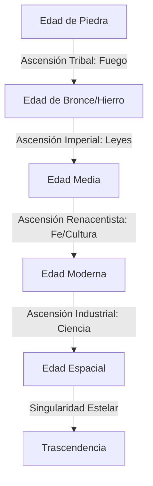

# Investigación SOTA: Mecánicas en Juegos de Barra de Tareas y Simulación en Segundo Plano
## Aplicación y Blueprint para el Diseño de "TASK BAR 4X"

Este documento presenta una investigación exhaustiva del Estado del Arte (SOTA) de los videojuegos diseñados para ejecutarse en la barra de tareas o en segundo plano (simulación pasiva/incremental). El objetivo es extraer las mejores prácticas y proponer un diseño armónico para **TASK BAR 4X**, un videojuego incremental de estrategia 4X (Explorar, Expandir, Explotar, Exterminar) adaptado a un formato ultra-compacto y estructurado a lo largo de 5 Edades de la historia humana y espacial.

---

## 1. Análisis de Casos de Estudio SOTA

### A. Rusty's Retirement (La Estética de la Logística Pasiva)
*   **Formato e Interfaz:** Se ejecuta de forma persistente en una franja horizontal personalizable en la parte inferior o superior de la pantalla (normalmente de ~80px de alto), permitiendo interactuar con otras aplicaciones sin interrumpir el flujo visual.
*   **Mecánica de Automatización:** El juego pasa de la recolección manual de cultivos al despliegue de robots especializados (riego, cosecha, producción de biocombustible). Utiliza un sistema de **priorización de tareas** donde el jugador configura el orden de importancia de las actividades.
*   **Monetización de Tiempo y Retención:** El bucle principal genera un "efecto pecera". El jugador no experimenta urgencia, sino la satisfacción visual de ver una línea de ensamblaje en miniatura funcionando de forma eficiente mientras trabaja en sus tareas reales.
*   **Lección para Task Bar 4X:** La representación física y animada de unidades de transporte y trabajadores en una barra lineal añade un valor estético inmenso que fomenta la retención pasiva.

### B. TBH: Task Bar Hero (El RPG de Barra de Tareas)
*   **Formato e Interfaz:** Minimizado directamente como un widget integrado en la barra de tareas de Windows, demostrando que es posible albergar sistemas complejos de rol en resoluciones minúsculas.
*   **Mecánicas de Progresión:** Auto-battler clásico con un grupo de hasta 3 héroes de distintas clases (Guerrero, Explorador, Hechicero, Sacerdote) que avanzan por actos y niveles de dificultad (Normal, Pesadilla, Infierno, Tormento).
*   **Personalización y Profundidad:** Sistema de runas de oro y el sistema del "Cubo" para incrustar runas y modificar estadísticas de equipamiento.
*   **Lección para Task Bar 4X:** El combate y la progresión militar 4X se pueden representar mediante un flujo automatizado lineal (un frente de batalla deslizante de izquierda a derecha en la barra de tareas) con preparación y optimización previa por menús.

### C. Leaf Blower Revolution (La Escalada de Prestigio Multicapa)
*   **Mecánica de Automatización:** Comienza requiriendo que el jugador barra hojas manualmente con clics. Eventualmente, se desbloquean sopladores robóticos, agujeros negros portátiles y compras automatizadas (Auto-buyers) que juegan por el usuario.
*   **Estructura de Prestigio (Ascensión):** Es el referente en sistemas de prestigio en capas:
    1.  *Prestigio Básico (Leaf Coins):* Resetea el progreso de hojas a cambio de multiplicadores de rango.
    2.  *Big Leaf Crunch (BLC):* Resetea las Leaf Coins y desbloquea mecánicas avanzadas (mascotas, portales, alquimia).
    3.  *Mega Leaf Crunch (MLC):* Resetea el BLC para acceder a la Torre de Desafíos y equipamiento.
    4.  *Sistemas Posteriores (Sacrificios, Gemas, Viaje Galáctico):* Cada capa introduce una divisa completamente nueva que rompe las reglas de la capa anterior.
*   **Lección para Task Bar 4X:** Cada Edad histórica debe comportarse como una capa de prestigio profunda. Al ascender de Edad, se resetea la infraestructura anterior, pero se conservan tecnologías clave que cambian por completo las reglas de juego.

### D. Melvor Idle (La Red de Sistemas Interconectados)
*   **Mecánicas de Automatización y Conexión:** Juego puramente basado en menús que simula la economía de un MMORPG. Su genialidad radica en la **interdependencia de habilidades**: la minería alimenta a la herrería, la herrería crea armas para el combate, el combate asegura materiales para la alquimia, y la agricultura provee comida para curar al personaje.
*   **Progresión Offline:** Utiliza un motor de cálculo determinista offline (hasta 24 horas) extremadamente preciso, que calcula tasas de éxito, desgaste de recursos e inventario.
*   **Lección para Task Bar 4X:** Los recursos 4X (Alimento, Producción, Ciencia, Oro) no deben existir de forma aislada. Su procesamiento e interconexión deben ser los cuellos de botella lógicos del juego.

### E. MicroCivilization (La Gestión de Crisis y Desastres)
*   **Mecánica Activa/Pasiva:** Fusiona la progresión incremental de una civilización con la aparición constante de crisis y desastres (plagas, incendios, invasiones, revoluciones) que requieren intervención activa del jugador mediante clics rápidos o el despliegue estratégico de héroes históricos.
*   **Árbol de Tecnología y Población:** La población es tanto la salud del reino como la fuerza laboral. Perder población en una crisis ralentiza drásticamente la producción.
*   **Lección para Task Bar 4X:** El aspecto "Exterminate" y la estabilidad interna del imperio no pueden ser 100% pasivos. Los eventos de desestabilización política o invasiones fronterizas actúan como "Active Windows Focus Points", estimulando la interacción del jugador.

### F. SpacePlan (La Narrativa Incremental)
*   **Mecánica Narrativa:** La progresión no es infinita, sino que está guiada por una historia satírica de ciencia ficción espacial. Los upgrades desbloquean entradas de registro y cambian la visualización gráfica de un planeta orbitado por satélites hechos de patatas.
*   **Lección para Task Bar 4X:** El progreso a través de las Edades no debe ser solo numérico; debe contar la historia de la civilización y reflejarse visualmente en la evolución estética de la barra de tareas.

---

## 2. Matriz de Análisis Comparativo SOTA

| Juego | Tipo de Interfaz | Bucle Activo Principal | Bucle Pasivo Principal | Capas de Prestigio | Mecánica de Retención Clave |
| :--- | :--- | :--- | :--- | :--- | :--- |
| **Rusty's Retirement** | Barra horizontal persistente | Clics en cultivos, posicionamiento de robots | Automatización robótica y producción de biofuel | Expansión de terrenos y cambio de biomas | Efecto acuario estético, nula fricción mental |
| **TBH: Task Bar Hero** | Widget de barra de tareas | Configuración de equipo, asignación de gemas | Auto-battle de la party y farmeo de runas | Niveles de dificultad de campaña (Normal a Torment) | Colección de botín y economía en Steam Market |
| **Leaf Blower Rev.** | Pantalla completa / Ventana | Soplado de hojas manual, uso de habilidades | Sopladores automáticos, Auto-buyers, física de viento | Multicapa (Monedas -> BLC -> MLC -> Pirámide) | Dopamina exponencial, desbloqueo constante |
| **Melvor Idle** | Menús y pestañas | Selección de tarea activa, gestión del inventario | Progreso determinista offline de habilidades | Modos de juego (Hardcore, Adventure) e Hitos | Optimización de cadenas de suministro cruzadas |
| **MicroCivilization** | Ventana clásica | Mitigación de desastres (clics), uso de habilidades | Crecimiento de población y generación de recursos | Avance de Era Histórica y Árbol de Héroes | Tensión de supervivencia ante crisis |
| **SpacePlan** | Ventana clásica | Clics manuales para energía inicial | Satélites orbitales y sondas de energía pasivas | Transiciones narrativas fijas | Curiosidad por el desarrollo de la trama |

---

## 3. Integración en el Blueprint de "TASK BAR 4X"

### A. Estructura de la Interfaz en Formato Ultra-Compacto
El juego opera en una barra horizontal de **40 a 60 píxeles de alto** que se sitúa justo por encima de la barra de tareas de Windows (o se integra como una ventana flotante con auto-ocultación).

```
+---------------------------------------------------------------------------------------------------------+
| [Era 1: Piedra] | (X) Territorio: OOOOO*OO.. | Logística: [Madera] => [Fuego] (3.2/s) | Pop: 14/20 [++] |
| [Menú: Tec/Dipl] | Evento: ¡Invasión en 02:40! | Oro: 120 (+1.2/s) | Ciencia: 84 (+0.5/s) | [⚙️ Config/Prestigio] |
+---------------------------------------------------------------------------------------------------------+
```

La pantalla se divide en tres secciones funcionales principales:
1.  **Módulo Izquierdo (Militar / Exploración / Mapa Lineal):** Representación 1D del territorio. Los puntos representan celdas exploradas (`O`), celdas enemigas/bárbaras (`*`), y celdas sin explorar (`.`). Se observa visualmente el avatar de los exploradores o ejércitos moviéndose linealmente de izquierda a derecha.
2.  **Módulo Central (Producción y Pipelines de Logística):** Muestra el recurso actual del "cuello de botella" y la eficiencia del pipeline. Flujos de iconos animados (ej. troncos de madera moviéndose hacia una fogata).
3.  **Módulo Derecho (Macro y Estado General):** Población, recursos globales (Ciencia, Oro) y el botón de acceso rápido al panel flotante de microgestión (Tecnologías, Leyes, Prestigio).

---

### B. El Game Loop Central 4X Adaptado
El flujo clásico de un juego 4X se adapta al minimalismo incremental de la siguiente manera:
*   **eXplorar:** Enviar exploradores de forma pasiva a lo largo del mapa lineal 1D. Descubren depósitos de recursos, civilizaciones rivales o ruinas antiguas. Requiere inversión en suministros (Alimento/Energía).
*   **eXpandir:** Gastar recursos en colonizar celdas exploradas. Cada celda colonizada añade espacio para población o infraestructura logística (granjas, minas, molinos).
*   **eXpletar:** Diseñar y refinar cadenas de producción (pipelines). Los recursos deben moverse de las celdas de recolección a las celdas de procesamiento y finalmente al tesoro nacional.
*   **eXterminar / Asimilar:** Manejar las celdas de conflicto (`*`). El combate es automático basado en la fuerza del ejército asignado a esa frontera, pero el jugador puede intervenir activamente activando "Tácticas de Batalla" (habilidades con enfriamiento).

---

## 4. Evolución de las 5 Edades: Mecánicas, Automatización y Prestigios

Para lograr una progresión rica, cada Edad histórica introduce mecánicas únicas, cuellos de botella específicos y sistemas de automatización que transforman el bucle de juego.



---

### EDAD 1: La Edad de Piedra (El Despertar Humano)
*   **Mecánica 4X Central (Explorar):** El juego comienza con clics en la fogata tribal para generar "Calor" y "Curiosidad". Los exploradores tribales avanzan a pie por el mapa lineal descubriendo bosques y presas de caza.
*   **Sistema de Automatización:** Se desbloquean los "Recolectores Tribales" (unidades automatizadas que caminan de izquierda a derecha recogiendo madera y comida, similar a los robots de *Rusty's Retirement*).
*   **Cuello de Botella Logístico:** *Capacidad de Carga.* La comida se pudre si no se almacena en cuevas. El jugador debe balancear constantemente la población asignada a la recolección contra los constructores de almacenes.
*   **Prestigio Intra-Edad (Leyes de la Horda):** Modificar la estructura social de la tribu (ej. "Matriarcado Cazador" vs "Patriarcado Constructor") a cambio de pequeños reinicios en la recolección activa.
*   **Prestigio de Ascensión (El Descubrimiento del Fuego):** Se realiza el primer gran reset del imperio. Se sacrifica toda la población y recursos acumulados para domesticar el fuego, lo que permite la fundición y da inicio a la **Edad de Bronce**. Conserva la "Pintura Rupestre" (un árbol de mejoras permanentes basadas en hitos).

---

### EDAD 2: La Edad de Bronce/Hierro (Ciudades-Estado e Imperios)
*   **Mecánica 4X Central (Expandir):** La expansión territorial ahora requiere fundar colonias conectadas por rutas de caravanas lineales. El mapa 1D se vuelve más complejo, introduciendo ríos y montañas que bloquean el paso.
*   **Sistema de Automatización (Canales y Metalurgia):** Automatización del agua. Se construyen canales que irrigan granjas de forma pasiva, eliminando la necesidad de asignar población a la agricultura manual. Las herrerías procesan de manera continua el cobre y estaño en bronce.
*   **Cuello de Botella Logístico:** *Fatiga de Herramientas y Distribución.* Las herramientas de bronce se desgastan con el uso. Si la cadena de suministro de metal se corta, la eficiencia de todas las granjas y minas cae drásticamente.
*   **Prestigio Intra-Edad (Código de Leyes):** Promulgar leyes imperiales (ej. *Código de Hammurabi*) que otorgan bonificaciones pasivas de estabilidad a cambio de oro.
*   **Prestigio de Ascensión (La Ruta de la Seda):** Resetea las colonias y las rutas de caravanas a cambio de establecer un "Legado Comercial Estructurado". Desbloquea la moneda de prestigio "Cultura" e inicia la **Edad Media**.

---

### EDAD 3: La Edad Media (Feudalismo y Mecanización Hidráulica)
*   **Mecánica 4X Central (Explotar):** Introducción de los Feudos. La población se divide rígidamente en siervos, clérigos y nobles. La producción agrícola y mineral se realiza en tierras feudales controladas por señores que exigen tributos.
*   **Sistema de Automatización (Energía Cinética):** Introducción de molinos de viento y de agua. Estas megaestructuras automatizan el procesamiento de grano a gran escala y activan martillos hidráulicos en las minas, multiplicando por 10 la producción pasiva sin consumir mano de obra.
*   **Cuello de Botella Logístico:** *Servidumbre y Diezmo.* La iglesia exige una fracción de los recursos generados (Fe). Si la fe es baja, la estabilidad del imperio decae, provocando revueltas campesinas (crisis activas al estilo de *MicroCivilization* que bloquean la barra de tareas con incendios virtuales).
*   **Prestigio Intra-Edad (Guerra de Cruzada):** Enviar ejércitos sagrados a misiones de frontera. Si tienen éxito, aumentan la generación de Fe permanentemente; si fallan, debilitan al imperio.
*   **Prestigio de Ascensión (La Reforma y el Renacimiento):** La acumulación de Fe y Cultura desencadena la transición hacia la **Edad Moderna**. Se resetea el sistema feudal y los molinos a cambio de "Patentes Científicas" y la liberación de la servidumbre.

---

### EDAD 4: La Edad Moderna (Industrialización e Imperialismo Global)
*   **Mecánica 4X Central (Exterminar/Asimilar):** La guerra se industrializa. El mapa lineal muestra frentes de batalla con trincheras y artillería. Se colonizan territorios ultramarinos de manera abstracta mediante barcos de vapor en un panel secundario.
*   **Sistema de Automatización (Cadenas de Montaje a Vapor):** Ferrocarriles y fábricas de vapor. Los recursos ya no viajan mediante caravanas pasivas, sino a través de trenes automatizados que recorren la barra de tareas en segundo plano. Las fábricas convierten carbón y hierro en maquinaria y bienes de consumo de forma masiva.
*   **Cuello de Botella Logístico:** *Combustión de Carbón y Malestar Obrero.* El carbón es consumido a tasas exponenciales para mantener las fábricas y trenes activos. Además, la contaminación y las jornadas laborales provocan huelgas obreras que detienen la automatización de la logística.
*   **Prestigio Intra-Edad (Constitución y Elecciones):** Elegir un partido político que otorga bufos masivos a la industria o a la estabilidad social a costa de restringir ciertas libertades económicas.
*   **Prestigio de Ascensión (El Salto Digital):** Consiste en consolidar toda la energía e investigación de la era industrial para construir el primer supercomputador. Resetea la infraestructura de vapor para dar paso a la **Edad Espacial**, conservando "Satélites de Datos" como potenciadores globales.

---

### EDAD 5: La Edad Espacial (La Conquista Estelar y la Singularidad)
*   **Mecánica 4X Central (Trascendencia):** El mapa 1D de la barra de tareas se convierte en una órbita planetaria y un sistema estelar simplificado. El jugador explora asteroides y lunas utilizando sondas y satélites automatizados.
*   **Sistema de Automatización (Robótica Avanzada y Esferas de Dyson):** Drones mineros espaciales e impresoras de antimateria. Se construyen colectores solares en órbita alrededor de la estrella para alimentar la infraestructura planetaria directamente sin cables.
*   **Cuello de Botella Logístico:** *Latencia de Red y Radiación Espacial.* El tiempo de transporte físico en el espacio exterior se modela con retrasos de red (latencia lineal). Los satélites pueden ser destruidos por tormentas solares, requiriendo sistemas redundantes de reparación automática.
*   **Prestigio Intra-Edad (Políticas Transhumanistas):** Modificaciones genéticas y cibernéticas de la población para cambiar sus tasas de consumo de recursos básicos.
*   **Prestigio Final (La Singularidad Tecnológica):** Al acumular suficiente "Cómputo Global", la civilización trasciende su forma física. El juego se reinicia en un modo "New Game+" con multiplicadores masivos y la capacidad de colonizar dimensiones paralelas en una barra de tareas "multiverso".

---

## 5. El Sistema de Pipelines y Logística Lineal 1D

Para encajar perfectamente en el formato estrecho y horizontal de la barra de tareas, TASK BAR 4X utiliza una mecánica única de **Logística Lineal (Pipelines)** inspirada en los transportadores de *Rusty's Retirement* y las habilidades conectadas de *Melvor Idle*.

### Funcionamiento de los Pipelines de Recursos
*   Los recursos no se teletransportan al almacén global al instante. Deben moverse físicamente a lo largo de la barra de tareas de izquierda a derecha.
*   **Eslabón de Extracción (Extrema Izquierda):** Minas, Granjas, Aserraderos. Generan recursos en forma de paquetes visuales (pequeños cubos de colores en movimiento).
*   **Eslabón de Tránsito (Centro):** Carreteras, Canales, Vías de Tren o Autopistas de Datos. La velocidad a la que los recursos cruzan la pantalla determina el rendimiento real de la producción por segundo.
*   **Eslabón de Procesamiento (Derecha):** Fundiciones, Molinos, Fábricas o Centros de Datos. Consumen los paquetes que entran por el lado izquierdo y los transforman en recursos finales (Oro, Ciencia, Fe, Unidades).

> [!TIP]
> **Optimización de Tránsito:** Si el jugador amontona demasiados centros de extracción sin mejorar las vías de tránsito, se produce un "atascamiento logístico", ralentizando la velocidad de producción. Mejorar las vías de transporte es más valioso a largo plazo que aumentar el número de recolectores.

---

## 6. Balance del Bucle Pasivo / Activo y Retención

Un gran desafío en los juegos de simulación en segundo plano es evitar que se conviertan en "salvapantallas" interactivos de los que el jugador se olvida rápido, o que exijan demasiada atención al punto de interrumpir su trabajo de oficina o sesiones de navegación.

### Estrategias de Retención y Sesión de TASK BAR 4X
1.  **Bono de Enfoque Activo (Focus Window Bonus):**
    Inspirado en *Leaf Blower Revolution*. Cuando la mini-ventana del juego está seleccionada o el cursor pasa por encima de la barra de tareas, la velocidad de los trabajadores/robots aumenta un **25%**. Esto incentiva al jugador a interactuar durante breves descansos de su jornada diaria.
2.  **El Sistema de Alertas Silenciosas:**
    El borde de la barra de tareas puede parpadear sutilmente en colores específicos para notificar eventos sin interrumpir al usuario (ej. Amarillo para frontera bajo ataque, Azul para investigación tecnológica completada, Verde para almacenes llenos).
3.  **Progresión Offline Determinista Con Límites de Almacén:**
    Cuando el juego está cerrado, simula el paso del tiempo hasta un máximo de **12 horas** (ampliable mediante tecnologías). Sin embargo, el almacenamiento de recursos es finito. Al regresar, el jugador se encuentra con la satisfacción de recolectar el botín acumulado y la tarea inmediata de gastarlo para no desperdiciar la producción continua.
4.  **Desastres y Crisis Pasivo-Activas:**
    Inspirado en *MicroCivilization*. De forma aleatoria o debido a una mala gestión (ej. baja Fe en la Edad Media o contaminación en la Edad Moderna), se desatará una crisis. Visualmente, pequeños sprites de fuego o enemigos aparecerán sobre las celdas de la barra de tareas. Si el jugador hace clic activamente sobre ellos, los sofoca al instante. Si los ignora, su ejército o policía los resolverá pasivamente, pero a un coste del **50% de la producción de esa celda** durante la duración del desastre. Esto introduce una toma de decisiones orgánica sobre cuándo intervenir de manera activa.

---

## 7. Conclusión y Recomendaciones de Diseño SOTA

Para que **TASK BAR 4X** sea un producto altamente adictivo y exitoso en el mercado de PC (Steam), debe centrarse en:
*   **Cero intrusión en el sistema:** El juego debe ser ligero, consumir mínimos recursos de CPU/GPU y tener un sistema de clic a través (Click-Through) para que los clics accidentales no interrumpan el flujo de trabajo del usuario.
*   **Dopamina Visual:** El movimiento constante de los recursos en los pipelines y las animaciones de los trabajadores a pequeña escala deben ser impecables y relajantes.
*   **Progresión Rompecabezas:** Que cada transición de Edad cambie las reglas para que el jugador sienta que está empezando un sistema nuevo con herramientas potenciadas, evitando la fatiga del bucle infinito de números grandes sin sustancia.
